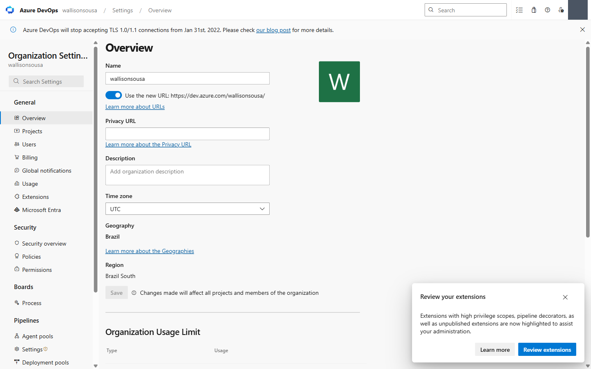
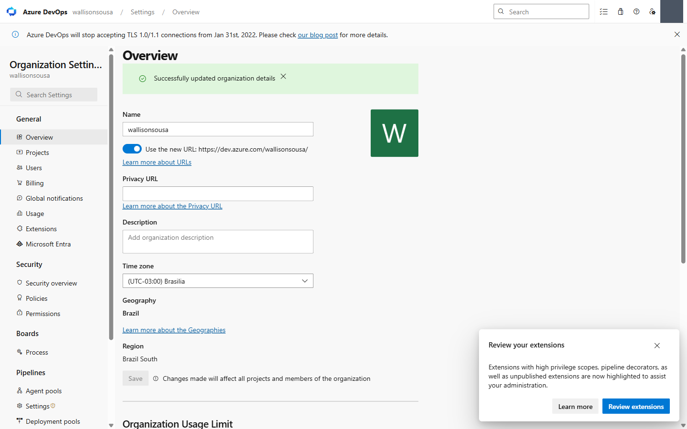
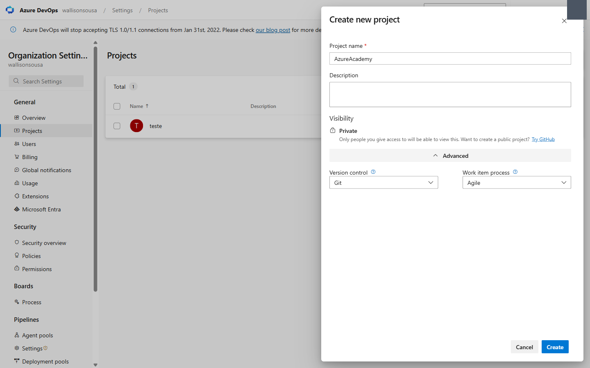
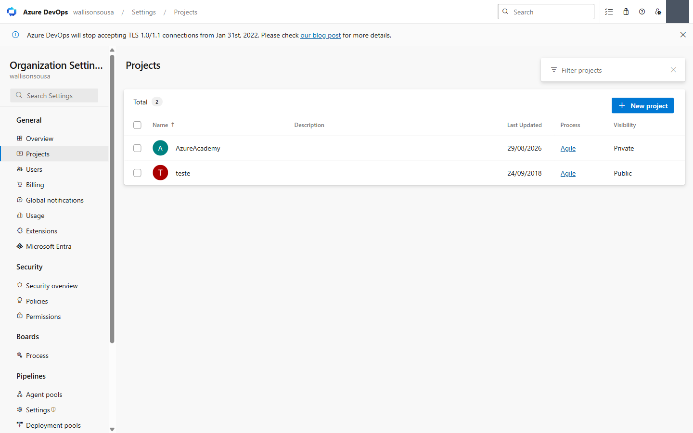
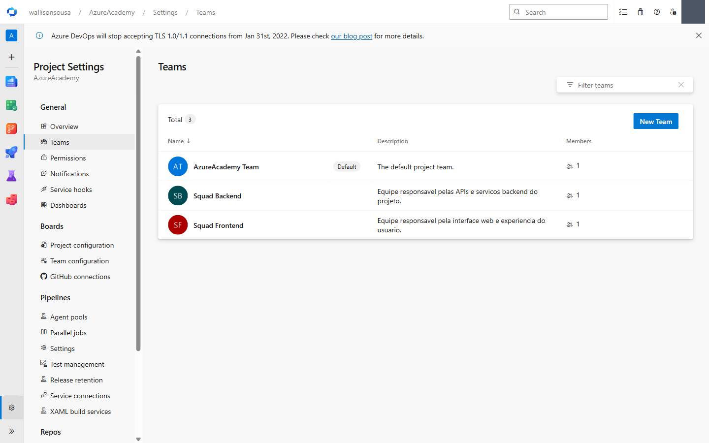
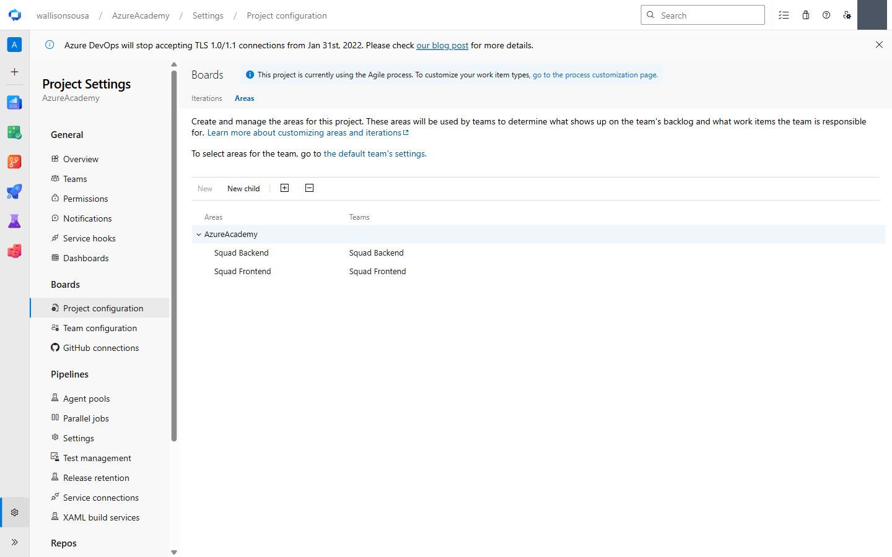
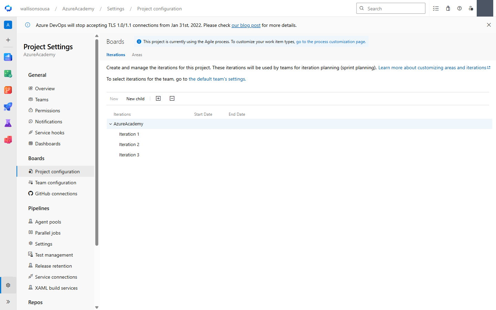
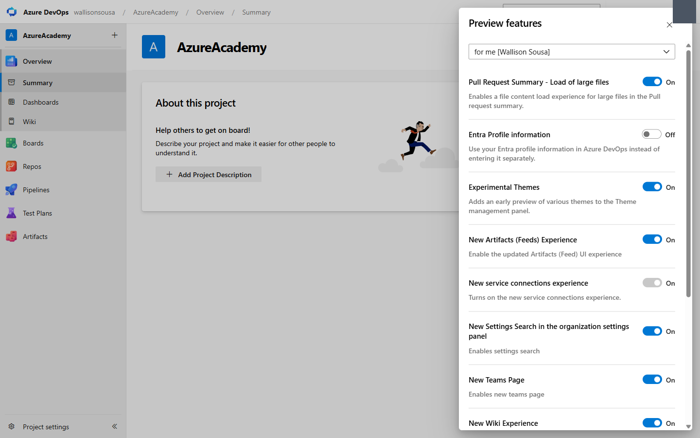
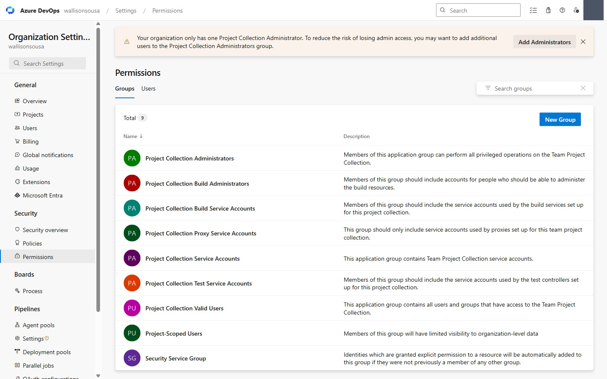
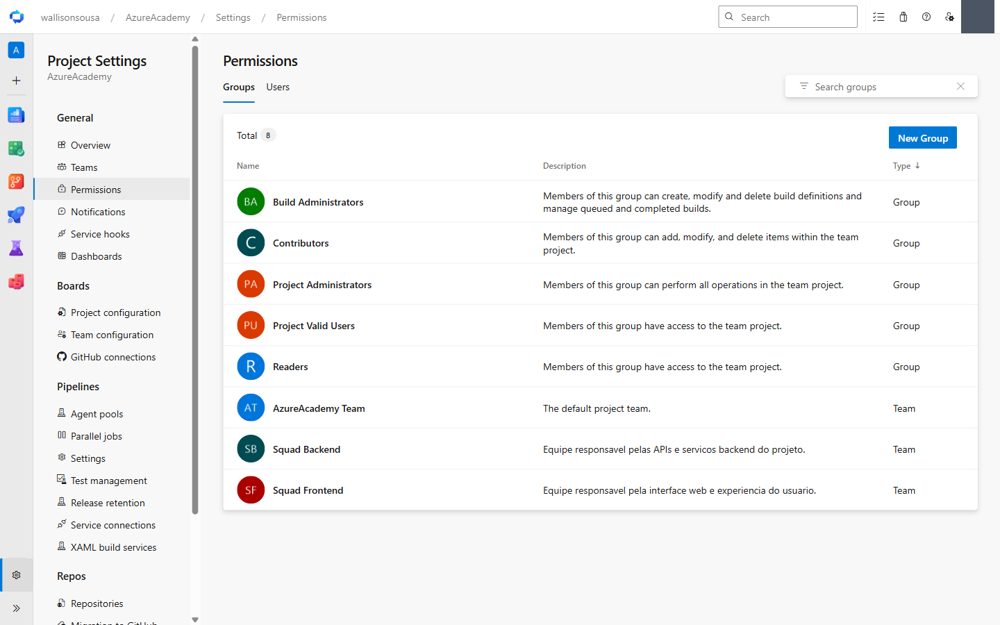

# 🧪 Módulo 1 — Introdução, Organizações, Projetos e Equipes

> **Tema:** O que é DevOps e o que é a plataforma Azure DevOps; como se estrutura uma **organização**, seus **projetos** e suas **equipes**
> **Pré-requisitos:** conta Microsoft com acesso ao [portal.azure.com](https://portal.azure.com) · [01 — Criar a organização](01-criar-organizacao-azure-devops.md)
> **Conceitos base:** [Devops/README.md](../../README.md) (fundamentos DevOps), [Devops/Cloud/README.md](../README.md) (nuvem), [Devops/Jenkins](../../Jenkins/README.md) (o CI/CD self-hosted que serve de contraponto)
> **Curso:** Azure Academy — *Azure DevOps & GitHub*, **Turma 14** · Módulo **DevOps**
> **Próximo:** [Módulo 2 — Boards, Backlog, Sprints, Dashboards e Queries](lab-02-boards-backlog-sprints-dashboards-queries.md)

---

## 🎯 Objetivo do Módulo

Sair do zero até ter uma **organização configurada, com projeto, equipes, permissões e áreas** — que é a fundação sobre a qual todos os outros oito módulos rodam.

O módulo tem **dois laboratórios**: *Configurando Organizações* e *Projects*.

---

## 📖 Parte conceitual

### O que é DevOps

> **DevOps é a união de pessoas, processos e tecnologias para entregar valor contínuo aos usuários.**

A ênfase do curso é clara e vale repetir: **cultura antes de ferramenta**. O Azure DevOps é a *materialização* dessa cultura numa plataforma integrada — não o contrário.

O ciclo é contínuo, e a saída do monitoramento **realimenta o planejamento**:

```
Plan → Code → Build → Test → Release → Deploy → Operate → Monitor
  ↑                                                            │
  └────────────────── feedback ────────────────────────────────┘
```

Três pilares sustentam o ciclo:

| Pilar | O que significa |
|-------|-----------------|
| **Fluxo** | Automatizar o caminho da ideia até a produção, reduzindo trabalho manual e *handoffs* |
| **Feedback** | Encurtar o loop entre alteração e sinal — testes, telemetria, observabilidade |
| **Aprendizado** | Experimentar com segurança: iteração curta, métricas, melhoria contínua |

### O que é o Azure DevOps

Conjunto de serviços que cobre **todo o ciclo de vida** do software. Herda a linhagem **TFS → Visual Studio Team Services → Azure DevOps**.

| Modelo | Quando usar |
|--------|-------------|
| **Azure DevOps Services** (SaaS) | Hospedado pela Microsoft, sempre atualizado, escala elástica, billing no Azure |
| **Azure DevOps Server** (self-hosted) | On-premises, para requisitos de residência de dados, isolamento ou conformidade |

Quatro características da plataforma que explicam quase todas as decisões de produto:

- **Organização › Projeto** — a organização é a unidade de topo; dentro dela, cada projeto ativa serviços de forma independente
- **Serviços modulares** — Boards, Repos, Pipelines… podem ser **ligados ou desligados por projeto**
- **Interoperável** — dá para usar só o que interessa (ex.: código no GitHub, CI/CD no Azure Pipelines)
- **Aberto e extensível** — Marketplace, REST API, webhooks e o **Azure DevOps MCP Server** para IA

### Os cinco serviços

| # | Serviço | Etapa | Para que serve |
|---|---------|-------|----------------|
| 1 | **Azure Boards** | PLAN | Work items hierárquicos (Épicos › Features › User Stories › Tasks), Kanban, sprints, WIQL, dashboards. **4 níveis de backlog** padrão |
| 2 | **Azure Repos** | CODE | Git privado **ilimitado e sem custo por repositório**, pull requests, branch policies, TFVC para legado |
| 3 | **Azure Pipelines** | BUILD · RELEASE | CI/CD em YAML versionado, multistage, multiplataforma, environments/approvals/gates. **10+ linguagens e destinos** |
| 4 | **Azure Test Plans** | TEST | Testes manuais, exploratórios e UAT no navegador, com rastreabilidade requisito → caso → bug |
| 5 | **Azure Artifacts** | PACKAGE | Feeds NuGet/npm/Maven/Python/Universal, *upstream sources*, retenção. **2 GiB grátis** por organização |

> 🔑 **A tese central do módulo:** *o valor está na integração, não em ferramentas isoladas.* Identidade (Entra ID), RBAC, auditoria, dashboards e Marketplace **atravessam** os cinco serviços. Um commit se liga ao PR, ao build, ao teste e ao work item — auditoria completa, sem trocar de contexto.

### Azure DevOps × GitHub: não é escolha excludente

| Azure DevOps | GitHub | Cenário híbrido |
|---|---|---|
| Suíte ALM completa | Colaboração social e open source | **Código no GitHub, CI/CD no Pipelines** |
| Boards com Scrum/CMMI | GitHub Actions | Boards vinculado a repos do GitHub |
| Test Plans e governança corporativa | Advanced Security, Copilot | Artifacts como feed corporativo |
| TFVC para bases legadas | Padrão de fato para código público | Migração gradual, sem ruptura |

> 💡 **Escolha por time, não por imposição.**

### Preço: comece grátis, escale por uso

| Item | Valor |
|------|-------|
| **Free tier** | US$ 0 — **5 usuários** com licença Basic |
| Azure Repos | Git privado **ilimitado** |
| Azure Pipelines | **1 job Microsoft-hosted (1.800 min/mês)** + **1 job self-hosted, minutos ilimitados** |
| Azure Artifacts | **2 GiB** |
| **Basic** (6º usuário em diante) | **US$ 6** /usuário/mês |
| **Basic + Test Plans** | **US$ 52** /usuário/mês |
| **Stakeholder** | **US$ 0**, usuários ilimitados (ver boards e dashboards) |
| Job paralelo Microsoft-hosted extra | **US$ 40** /mês |
| Job paralelo self-hosted extra | **US$ 15** /mês |

> 🔑 **A regra que muda como se otimiza um pipeline:** *no Pipelines não há custo por usuário — cobra-se **concorrência**, não headcount.* Qualquer número de pessoas pode criar builds. Isso é o oposto do modelo de licença por assento, e é a razão pela qual a atividade [02](02-ativar-agent-pool.md) existe.

**Otimização típica de fatura:** Stakeholders grátis + agentes self-hosted + política de retenção no Artifacts.

### Métricas DORA — como se mede o resultado

| Métrica | Traduz em |
|---------|-----------|
| **Deployment Frequency** | Time-to-market: valor em lotes menores e mais frequentes |
| **Lead Time for Changes** | Do commit à produção — quanto menor, mais ágil |
| **Change Failure Rate** | Qualidade e confiança: menos incidentes por mudança |
| **Time to Restore** | Rollback e restauração rápidos quando algo falha |

---

## 🗺️ Por onde começar — a ordem que o curso recomenda

1. Crie uma **Organização**
2. Determine as **configurações** e convide os **usuários**
3. Segmente os usuários em grupos (**Equipes**)
4. Crie os **Projetos** da Organização
5. Configure a segmentação de equipes dos projetos e suas **permissões**

> 📌 **Organização:** mecanismo para organizar e conectar grupos de projetos relacionados. Pode ser uma para toda a empresa, uma só para você, ou separadas por unidade de negócio. Nela se configura: **Projetos · Usuários/Equipes · Notificações globais · Cobrança**.

> 📌 **Projeto:** organiza o time e o fluxo de trabalho. É onde o time **efetivamente trabalha no dia a dia** — guarda o repositório, as esteiras de build e deploy, e a comunicação.

---

## 🔧 Lab 1 — Configurando Organizações

| # | Passo |
|---|-------|
| 1 | Acesse `dev.azure.com` com sua conta do Azure DevOps |
| 2 | **Crie uma nova organização** |
| 3 | Verifique as configurações da guia **Overview** |
| 4 | Nas configurações da Organização, crie um **novo projeto Agile privado** |
| 5 | Na guia **Users**, convide outros usuários simulando a composição inicial de um time |
| 6 | Ative as **Preview Features** | ✅ |
| 7 | Na guia **Permissions**, configure ou verifique as permissões do grupo criado |

> ⚠️ **As permissões globais são configuradas na Organização** e podem ser personalizadas depois em cada projeto.

### Detalhes que o roteiro pressupõe

**Passo 2 — nome e região.** O nome é **único globalmente** (disputa espaço com todos os clientes da Microsoft) e vira a URL `dev.azure.com/SUA-ORG`. A região define **residência de dados** e latência, e é escolhida na criação. Ambos são, na prática, irreversíveis — detalhes em [01-criar-organizacao-azure-devops.md](01-criar-organizacao-azure-devops.md).

**Passo 4 — por que Agile e por que privado.**

| Processo | Quando faz sentido |
|----------|--------------------|
| **Basic** | Times pequenos; só Issues/Tasks/Epics |
| **Agile** | Padrão do curso: User Stories + Bugs, estados *New → Active → Resolved → Closed* |
| **Scrum** | Product Backlog Items, estados *New → Approved → Committed → Done* |
| **CMMI** | Ambientes formais/regulados: Requirements, Change Requests, Reviews |

*Privado* = só quem você convida enxerga. *Público* daria **10 jobs paralelos grátis com minutos ilimitados** em vez de 1 — vale saber, mas não para código de trabalho.

**Passo 6 — Preview Features.** Ficam no menu do avatar → *Preview features*, com dois escopos: **for me** (só você) e **for this organization** (todos). Recursos em preview mudam sem aviso; ligar para a organização inteira num ambiente sério merece cautela.

**Passo 7 — o modelo de permissões.** A organização vem com **9 grupos** (ver a execução registrada abaixo); os três que importam no dia a dia:

| Grupo | Pode |
|-------|------|
| **Project Collection Administrators** | Tudo na organização — criar/excluir projetos, billing, políticas |
| **Project Collection Valid Users** | Ver a organização (todo mundo cai aqui) |
| **Project Collection Build Administrators** | Administrar recursos de build de toda a coleção |

Permissões avaliam em três estados — **Allow**, **Deny** e **Not set** — e **Deny sempre vence**. É a origem clássica de "por que fulano não consegue, se está no grupo certo?": ele está em **outro** grupo com Deny explícito.

---

## 🔧 Lab 2 — Projects

| # | Passo |
|---|-------|
| 1 | Acesse o projeto criado anteriormente |
| 2 | Clique nas **configurações do Projeto** |
| 3 | Verifique a guia **Overview** |
| 4 | Na guia **Teams**, configure **2 equipes** de trabalho atribuindo os usuários da organização |
| 5 | Na guia **Permissions**, configure as permissões dos times criados |
| 6 | Na guia **Notifications**, edite algumas notificações e adicione outras |
| 7 | Em **Project configuration › Areas**, crie novos **departamentos** |

### Por que "2 equipes" e não uma

Cada **team** ganha de brinde: seu próprio **backlog**, **board**, **sprints**, **capacity planning** e **dashboards**. Criar duas equipes é o que torna visível o mecanismo que sustenta o Módulo 2 — e o que separa *um projeto com um time* de *um projeto que escala*.

### Areas × Iterations — o par que confunde

| Eixo | Responde | Exemplo |
|------|----------|---------|
| **Area Path** | **ONDE / QUEM** — a dimensão do produto ou do departamento | `Contoso/Financeiro`, `Contoso/Mobile` |
| **Iteration Path** | **QUANDO** — a dimensão do tempo | `Contoso/Sprint 1`, `Contoso/2026-Q3` |

O passo 7 pede *departamentos* justamente porque **Area é o eixo organizacional**. E é assim que a mágica do passo 4 acontece: cada team é **associada a uma ou mais areas**, e o backlog dela passa a mostrar automaticamente só os work items daquelas áreas. Sem areas bem definidas, todo mundo vê o backlog de todo mundo.

### Equipes × Cultura — a nota do curso

- Compor times depende das **estratégias de projeto e da cultura da empresa**
- Times **com autonomia**, organizados por sinergia e skills, trabalham melhor rumo ao mesmo objetivo
- **Conceitos de hierarquia já não estão mais em alta**
- A cultura da inovação incentiva que **todos** melhorem o processo continuamente

E metas precisam ser **mensuráveis, com cronograma desafiador mas alcançável** — o curso dá exemplos concretos:

- Reduzir o tempo gasto na correção de bugs em **60%**
- Reduzir o tempo gasto em trabalho não planejado em **70%**
- Reduzir o trabalho fora de hora para **não mais de 10%** do tempo total

---

## 🧾 Execução registrada

Executado em **29/08/2026** na organização `dev.azure.com/wallisonsousa`. A organização nova (`AzureAcademycurso`) ficou pendente por causa da assinatura do Azure — ver o Troubleshooting abaixo. **Nada do que foi feito aqui depende dela**, e nada vira retrabalho quando ela existir.

### Passo 3 — Organization settings › Overview



O que a tela entrega de uma vez: **Name** (editável, mas é a URL), o toggle da *new URL* `dev.azure.com/…`, **Time zone**, **Geography: Brazil**, **Region: Brazil South**, e mais abaixo *Organization Usage Limit* (`Projects 1/1000`, `Work Item Tags 0/150000`), **Organization owner** e **Delete organization**.

> ⚠️ Repare no aviso ao lado do botão Save: *"Changes made will affect all projects and members of the organization"*. Overview é escopo de organização — o que muda aqui atinge todo mundo.

### O ajuste que o professor pediu — Time zone

A organização vinha em **UTC**, e não é detalhe cosmético: o time zone da organização é o que define **a virada do dia** para sprints, burndown, capacity e os gráficos do Boards. Em UTC, tudo que acontece depois das 21h no horário de Brasília é contabilizado no **dia seguinte**.

`Time zone` → busca `Brasilia` → **(UTC-03:00) Brasilia** → **Save**:



> ✅ `Successfully updated organization details`

### Passo 4 — Projeto Agile privado

O processo **não** fica na tela principal do diálogo: é preciso abrir **Advanced**. Ali aparecem *Version control* (**Git**) e *Work item process* (**Agile**) — ambos já são o padrão, mas o lab pede para conferir conscientemente.



> 💡 **Visibility:** o diálogo só oferece **Private**. Projeto *público* no Azure DevOps foi descontinuado para organizações novas — o próprio texto sugere *"Want to create a public project? Try GitHub"*.



A lista confirma `AzureAcademy · Agile · Private`.

> 🔍 **Achado interessante:** o projeto antigo `teste` está como **Public** — ele é de 2018, quando organizações pessoais ainda podiam criar projetos públicos. E projeto público tem **10 jobs paralelos grátis com minutos ilimitados**, contra 1 job / 1.800 min do privado. Se algum dia o limite de minutos apertar, esse projeto legado é um curinga que não dá para recriar hoje.

### Lab 2, Passo 4 — as duas equipes

No diálogo *Create a new team*, três defaults merecem atenção:

| Campo | Default | Por quê importa |
|-------|---------|-----------------|
| **Add admin(s) to team as member(s)** | ✅ marcado | Quem cria a equipe já entra como membro; sem isso a equipe nasce vazia |
| **Permissions** | `[AzureAcademy]\Contributors` | A equipe **herda** as permissões do grupo — é o atalho que o Lab 1 passo 7 explica |
| **Create an area path with the name of the team** | ✅ marcado | **É aqui que Team e Area se ligam**, automaticamente |



Total **3**: a `AzureAcademy Team` (**Default**, criada junto com o projeto) mais as duas do lab.

### Lab 2, Passo 7 — Areas

O banner confirma o processo: *"This project is currently using the **Agile** process"*. E a aba **Areas** mostra o resultado do checkbox marcado no passo anterior:



```
Areas                Teams
AzureAcademy
  ├─ Squad Backend   → Squad Backend
  └─ Squad Frontend  → Squad Frontend
```

> 🔑 **A coluna `Teams` é a prova do mecanismo.** Cada area está vinculada à sua equipe — e é exatamente esse vínculo que faz o backlog de cada uma mostrar só os work items dela. Marcar aquele checkbox no diálogo da equipe poupou o passo manual de criar a area e associá-la depois.
>
> A própria tela diz: *"These areas will be used by teams to determine what shows up on the team's backlog and what work items the team is responsible for."*

O texto do lab fala em criar **departamentos** — é o mesmo eixo. `Squad Backend`/`Squad Frontend` são a dimensão organizacional; trocar por `Financeiro`/`Logística` seria a mesma estrutura com outro recorte. Areas também aceitam **hierarquia** (botão *New child*), o que permite `AzureAcademy/Produto/Squad Backend`.

As **Iterations** (a outra aba da mesma tela) já vêm com `Iteration 1`, `2` e `3` criadas pelo template Agile — sem datas:



> 📌 Elas só viram sprints de verdade quando ganham datas e são atribuídas a uma equipe — o que acontece no Módulo 2.

---

### Passo 6 — Preview Features

Ficam no menu do **avatar/engrenagem** do topo → **Preview features**, não em Organization settings. O painel abre com um seletor de **escopo** no topo:

| Escopo | Alcance |
|--------|---------|
| **for me [seu nome]** | Só a sua conta |
| **for this organization** | **Todos** os usuários da organização |



Havia **12 recursos**, a maioria já ligada por padrão. Ativei dois que estavam desligados:

| Recurso | Por quê |
|---|---|
| **Pull Request Summary — Load of large files** | Carrega o conteúdo de arquivos grandes no resumo do PR. Útil já no Módulo 3 (Repos) |
| **Experimental Themes** | Temas extras no painel de tema. Puramente visual, risco zero |

Deixei **`Entra Profile information` desligado** de propósito: ele passa a usar o perfil do Entra em vez do perfil próprio do Azure DevOps. Numa conta que transita entre o diretório *Microsoft account* e um *Default Directory* — exatamente o caso aqui — isso muda qual nome e foto aparecem e só adiciona confusão.

> 🔑 **A leitura que interessa:** um recurso em preview muda **sem aviso** e pode sumir. No escopo *for me* o estrago é seu. No escopo *for this organization* você está mudando a interface de todo mundo — inclusive de gente que não sabe que aquilo é preview. Um recurso já vinha **desabilitado para edição** (`New service connections experience`, ligado e travado): a Microsoft o promoveu e tirou a opção de voltar.

### Passo 7 — Permissions

**Na organização** (*Organization settings › Permissions*): **9 grupos**.



| Grupo | Papel |
|---|---|
| **Project Collection Administrators** | Todas as operações privilegiadas da coleção |
| **Project Collection Build Administrators** | Administra os recursos de build |
| Project Collection **Build / Proxy / Test / Service Accounts** | Contas de serviço — 4 grupos separados por finalidade |
| **Project Collection Valid Users** | Todos que têm acesso à coleção |
| **Project-Scoped Users** | Visibilidade **limitada** a dados de nível de organização |
| **Security Service Group** | Identidades com permissão explícita em algum recurso, sem outro grupo |

> 🚨 **O aviso que a própria tela dá:**
> *"Your organization only has one Project Collection Administrator. To reduce the risk of losing admin access, you may want to add additional users to the Project Collection Administrators group."*
>
> É um **ponto único de falha** real: perder o acesso a essa conta significa perder a administração da organização inteira. Em organização de estudo é aceitável; em ambiente de trabalho, é a primeira coisa a corrigir.

**No projeto** (*Project settings › Permissions*): **8 entradas** — e aqui está o detalhe que amarra este lab com o anterior.



Repare na coluna **Type**:

| Type | Entradas |
|---|---|
| **Group** | Build Administrators · **Contributors** · Project Administrators · Project Valid Users · Readers |
| **Team** | AzureAcademy Team · **Squad Backend** · **Squad Frontend** |

> 🔑 **Team É um grupo de segurança.** As duas equipes criadas no Lab 2 aparecem na tela de permissões porque, por baixo, *team* e *security group* são a mesma coisa no Azure DevOps — a team só ganha de brinde backlog, board, sprints e capacity.
>
> É por isso que o diálogo de criação da equipe trazia o campo **Permissions** já preenchido com `[AzureAcademy]\Contributors`: a nova team é **aninhada** dentro de Contributors e **herda** as permissões dele. Você não configura permissão por equipe do zero — você escolhe em qual grupo ela entra.

E é aqui que **Deny vence Allow** morde: como as equipes herdam de Contributors, basta um Deny em Contributors para derrubar todo mundo — mesmo quem tem Allow em outro lugar.

---

## 🐞 Troubleshooting Comum

Os dois primeiros foram encontrados **na prática**, executando este lab:

| Sintoma | Causa | Solução |
|---------|-------|---------|
| `The given organization name is already taken` | O nome é **único globalmente**, entre todos os clientes da Microsoft — o nome usado pelo instrutor na aula dele **não** fica livre para você | Acrescente algo seu (`AzureAcademy-SeuNome`, `AzureAcademycurso`). A validação só roda ao clicar em Continue |
| `Subscription is not valid. Reason code: DisabledSubscription` | A assinatura do Azure vinculada está **desabilitada** (trial expirado, cartão vencido) | `portal.azure.com` › **Assinaturas** › reativar, ou criar nova (*Pagamento Conforme o Uso* / *Azure for Students*). Enquanto isso, dá para fazer os labs numa **organização já existente** |
| Não aparece **New organization** | A conta está num tenant sem permissão | Troque o diretório (*Switch directory*), ou use conta pessoal |
| Assinatura não aparece na lista do Azure DevOps | Ela está em **outro diretório/tenant** | Compare o tenant em *Assinaturas* no portal com o do *Switch directory* na tela de signup |
| Usuário convidado não vê o projeto | Convite pendente, ou ele não foi adicionado ao **team** | *Users* mostra o status; adicionar à organização **não** adiciona ao projeto |
| Pessoa está no grupo certo e mesmo assim é barrada | **Deny** herdado de outro grupo | Deny vence sobre Allow. Rastreie todos os grupos dela |
| Backlog do time mostra work items de outro time | Areas não configuradas ou sobrepostas | *Project configuration › Areas* e revise a associação de cada team |

---

## 🧠 Conceitos Aprendidos

| Conceito | Resumo |
|----------|--------|
| **DevOps** | União de pessoas, processos e tecnologias para entregar valor contínuo. Cultura antes de ferramenta |
| **Ciclo contínuo** | Plan → Code → Build → Test → Release → Deploy → Operate → Monitor, realimentado |
| **Fluxo / Feedback / Aprendizado** | Os três pilares |
| **Organização** | Unidade de topo: projetos, usuários, notificações globais, **cobrança**, região dos dados |
| **Projeto** | Onde o time trabalha: repositório, esteiras, comunicação |
| **Team** | Ganha backlog, board, sprints, capacity e dashboards próprios |
| **Area × Iteration** | ONDE/QUEM × QUANDO — areas conectam team a backlog |
| **Os 5 serviços** | Boards · Repos · Pipelines · Test Plans · Artifacts |
| **Modularidade** | Serviços ligáveis/desligáveis por projeto; interoperável com GitHub |
| **Deny vence Allow** | Regra de ouro do modelo de permissões |
| **Cobra concorrência, não headcount** | No Pipelines não há custo por usuário |
| **DORA** | Deployment Frequency, Lead Time, Change Failure Rate, Time to Restore |

---

## ✅ Quiz Mental

**1. Qual a diferença prática entre criar 2 *projetos* e criar 2 *teams* dentro de um projeto?**

<details>
<summary>Ver resposta</summary>

**Teams** compartilham repositórios, pipelines e configuração do projeto — cada uma só ganha seu próprio **backlog, board, sprints, capacity e dashboards**. **Projetos** separam *tudo*: repos, pipelines, permissões, processo.

A regra prática é **poucos projetos, muitos repositórios e muitas teams**. Dois projetos para o mesmo produto significam dois backlogs desconectados e nenhuma visão única — exatamente o que o passo 4 do Lab 2 ensina a evitar.

</details>

**2. Uma pessoa está no grupo *Contributors*, que tem Allow em "Edit work items". Ela não consegue editar. Por quê?**

<details>
<summary>Ver resposta</summary>

Ela está em **outro** grupo com **Deny** explícito nessa permissão. **Deny sempre vence Allow**, não importa quantos grupos dão Allow.

Os três estados são **Allow**, **Deny** e **Not set** — e a depuração correta é listar *todos* os grupos da pessoa, não só aquele em que você esperava encontrá-la.

</details>

**3. Você configurou 2 teams, mas o backlog da equipe A mostra os work items da equipe B. O que faltou?**

<details>
<summary>Ver resposta</summary>

Faltou o **passo 7**: definir as **Areas** e associar cada team às suas.

O backlog de uma team é filtrado por **Area Path**. Sem areas distintas, ambas caem na area raiz do projeto e enxergam tudo. É por isso que "criar departamentos em Areas" e "criar 2 equipes" são o mesmo exercício, em dois momentos — um não funciona sem o outro.

</details>

**4. Seu time tem 12 pessoas, mas só 4 criam builds. Quantas licenças Basic e quantos jobs paralelos você precisa?**

<details>
<summary>Ver resposta</summary>

**Licenças:** 5 são grátis, então **7 × US$ 6 = US$ 42/mês** — e menos se parte do time só precisa *ver* boards e dashboards: aí é **Stakeholder**, grátis e ilimitado.

**Jobs paralelos:** a resposta é **independente do headcount**. No Pipelines cobra-se **concorrência**, não usuários — as 12 pessoas podem criar builds com **1 job paralelo**; elas só vão esperar na fila. Você compra job paralelo para reduzir **tempo de espera**, nunca para "dar acesso" a alguém.

</details>

---

## 🗺️ Status do Roadmap

| # | Módulo | Status |
|---|--------|--------|
| **1** | **Organizações, Projetos e Equipes** | 📋 **este doc** |
| 2 | [Boards, Backlog, Sprints, Dashboards e Queries](lab-02-boards-backlog-sprints-dashboards-queries.md) | 🟡 parcial |
| 3 | Repos: Azure DevOps e GitHub + Codespaces | 🔜 |
| 4 | Infra as Code e Automações | 🔜 |
| 5 | Pipelines — Builds | 🔜 |
| 6 | Pipelines — Release e Logic Apps | 🔜 |
| 7 | Deployment Groups — VMs | 🔜 |
| 8 | Testes manuais e automatizados | 🔜 |
| 9 | Extensões | 🔜 |

---

---

## 📚 Leitura complementar

| Livro | Onde | Por quê |
|---|---|---|
| **#09** *Implementing Azure DevOps Solutions* | cap. 1 — Introduction to DevOps | O porquê cultural por trás de organização → projeto → equipe |
| **#03** *Managing Agile Open-Source Software Projects* | livro todo | Gestão ágil dentro do próprio Azure DevOps |

> Acervo completo e critério de uso em **[bibliografia.md](bibliografia.md)**. Os arquivos ficam em `materiais/livros/`, fora do controle de versão.

## 🔗 Conexões

| Tema | Onde |
|------|------|
| Índice da formação | [README.md](README.md) |
| Criar a organização, passo a passo | [01-criar-organizacao-azure-devops.md](01-criar-organizacao-azure-devops.md) |
| Ligar o motor dos Pipelines | [02-ativar-agent-pool.md](02-ativar-agent-pool.md) |
| Fundamentos DevOps | [Devops/README.md](../../README.md) |
| O CI/CD self-hosted de contraponto | [Devops/Jenkins](../../Jenkins/README.md) |
| Fluxo de branches (vai para o Módulo 3) | [Devops/Gitflow](../../Gitflow/) |
| Microsserviços | [Arquitetura-de-Software/Microsservicos](../../../Arquitetura-de-Software/Microsservicos/) |
| Levantamento de requisitos (vira work item no Módulo 2) | [Governanca-e-Gestao/Gestao](../../../Governanca-e-Gestao/Gestao/levantamento-de-requisitos.md) |

---

## 💡 Reflexão Final

O módulo se apresenta como "introdução", mas o que ele realmente ensina é uma **hierarquia de decisões cujo custo de reversão cresce de baixo para cima**: trocar uma permissão é trivial; refazer as Areas dá trabalho; mudar o processo do projeto de Agile para Scrum é doloroso; renomear a organização quebra a URL de todo mundo; mudar a região exige chamado com a Microsoft.

Os quinze minutos de cliques do laboratório são, na verdade, quinze minutos de decisões arquiteturais disfarçadas de formulário.

E há um detalhe de modelo de cobrança que muda a forma de pensar entrega: **o Pipelines não cobra por pessoa, cobra por concorrência**. No [Jenkins](../../Jenkins/README.md), acelerar o build significa adicionar hardware; aqui significa comprar o direito de rodar mais coisas ao mesmo tempo. Um pipeline desenhado para dez jobs paralelos, com um job contratado, executa **em fila** — e leva exatamente o mesmo tempo do sequencial. Paralelizar sem olhar essa contagem é otimização que não produz efeito nenhum.
