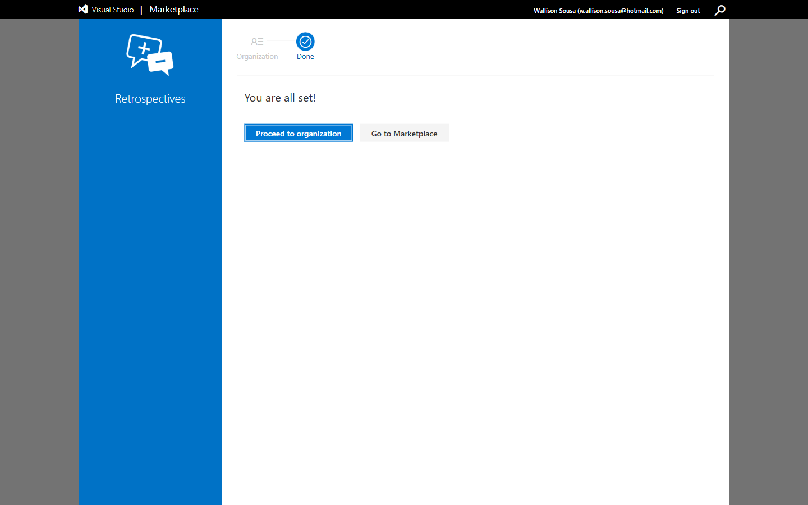
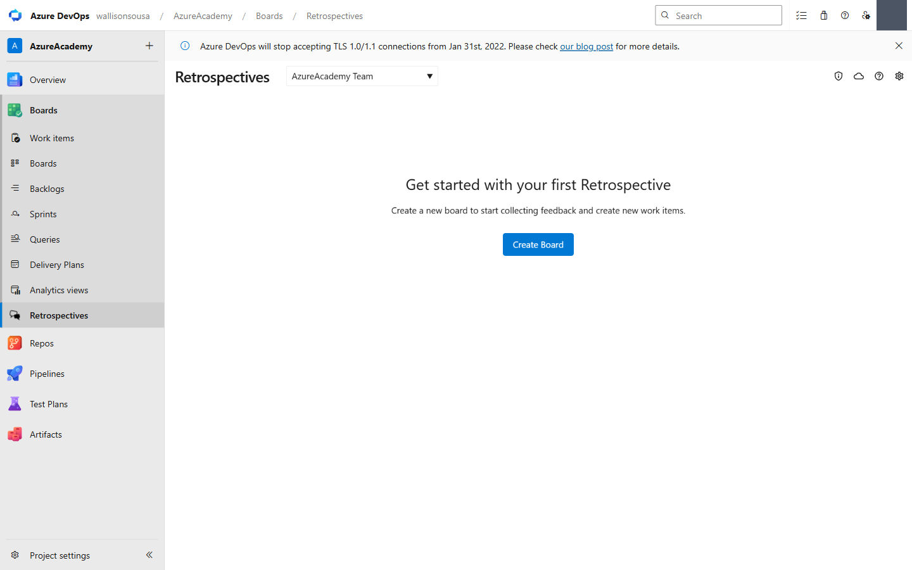
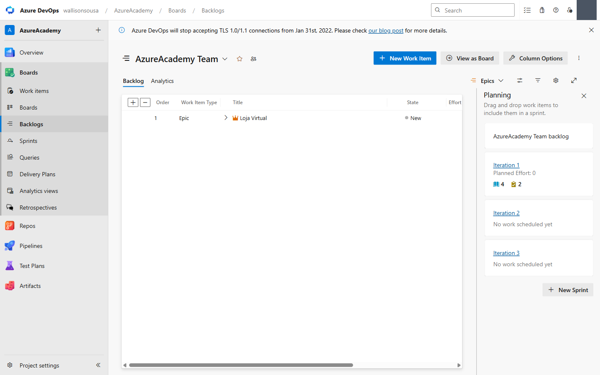
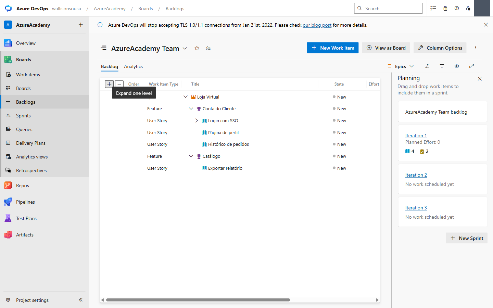
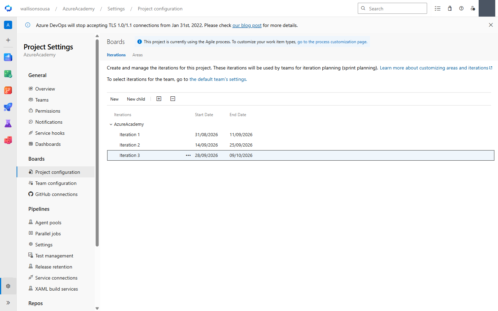
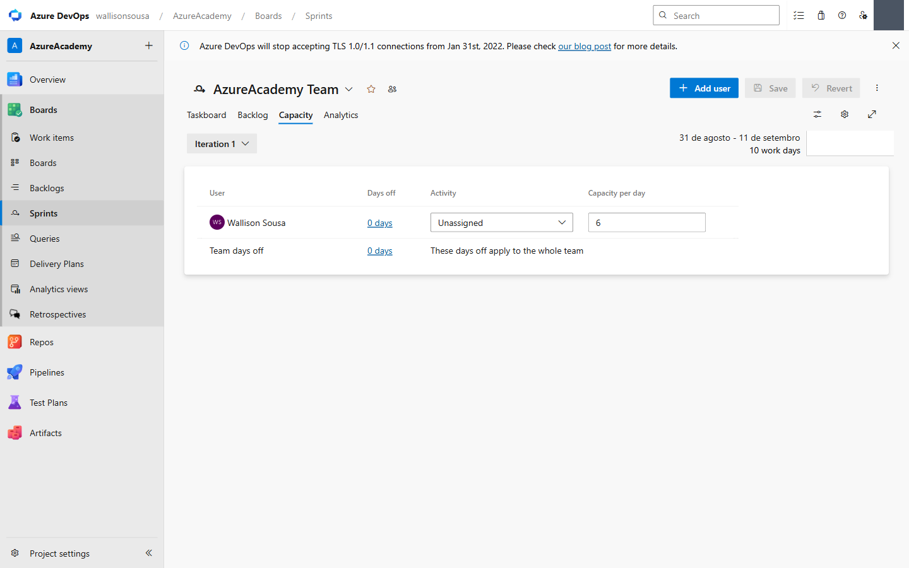
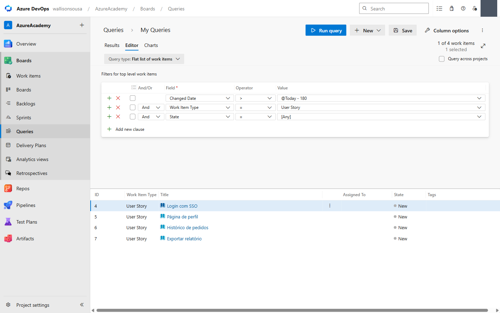

# 🧪 Módulo 2 — Boards: Backlog, Sprints, Dashboards e Queries

> **Tema:** Transformar ideia em trabalho rastreável — hierarquia de work items, backlog priorizado, sprint com capacidade real e as consultas que respondem perguntas
> **Pré-requisitos:** [Módulo 1](lab-01-organizacoes-projetos-e-equipes.md) — projeto Agile, equipes e Areas configuradas
> **Conceitos base:** [Governanca-e-Gestao/Gestao](../../../Governanca-e-Gestao/Gestao/levantamento-de-requisitos.md) (requisito → work item), [Devops/README.md](../../README.md)
> **Curso:** Azure Academy — *Azure DevOps & GitHub*, **Turma 14** · Módulo **Boards**
> **Material:** PDF do módulo + **lab online** `labs/devops/lab-backlog-sprints-capacidade` (3.205 palavras, bem mais detalhado que o PDF)

---

## 🎯 Objetivo do Módulo

Sair de um projeto vazio e chegar em **um sprint planejado com dado, não com achismo**: backlog priorizado e estimado, itens no sprint, tasks com horas e a capacidade do time equilibrada.

O lab online organiza isso em **5 fases**:

```
1 SETUP  →  2 BACKLOG  →  3 VISÕES  →  4 SPRINT  →  5 CAPACIDADE
```

---

## 📖 Parte conceitual

### Ágil: entregar valor em ciclos curtos

| Scrum — cadência por sprints | Kanban — fluxo contínuo |
|---|---|
| Iterações fixas (2–4 semanas) | Trabalho puxado, sem iterações |
| Papéis: Product Owner, Scrum Master | Limites de **WIP** por coluna |
| Cerimônias: planning, daily, review, **retro** | Foco em reduzir tempo de ciclo |
| Métricas: velocity, sprint burndown | Métricas: CFD, lead/cycle time |

O que o ágil valoriza: **Transparência** (todos veem o mesmo estado) · **Inspeção** (revisar resultado e processo) · **Adaptação** (ajustar com evidência) · **Colaboração** (times autônomos e multifuncionais).

### A hierarquia de work items

```
Epic                        Grandes iniciativas / portfólio
  ↓
Feature                     Capacidade entregável ao cliente
  ↓
User Story / PBI / Requirement    Trabalho de um time em uma iteração
  ↓
Task                        Trabalho técnico dentro do sprint
```

**Bug** entra como requisito (no backlog) **ou** como task sob um requisito — cada time decide. No projeto criado, o default é *"Bugs are managed with tasks"*.

> 🔑 **Rollup:** soma automática de Story Points, esforço ou trabalho restante **dos filhos** — mostra progresso de Features e Épicos sem cálculo manual. É a razão de o vínculo pai-filho importar tanto: itens soltos dão os mesmos cards, mas **nenhum rollup**.

O material dá dois exemplos de árvore:

| Exemplo genérico | Exemplo "Azure Academy" |
|---|---|
| Epic: *Site X* | Epic: *Azure Academy* |
| Features: *Catálogo, Serviços* | Features: *Turmas, Local, Fotos, Contato, Sobre* |
| US: *Efetuar login, listar produtos* | US: *Selecionar Fotos, Editar Fotos, Fazer o HTML* |

> 📌 *"A quebra de atividades em work itens é uma etapa essencial no planejamento e deve ser realizada por profissional com experiência."*

### Os dois números que não se misturam

| Métrica | Mede | Unidade | Responde |
|---|---|---|---|
| **Story Points** / Velocity | **Tamanho** entregue por sprint | Pontos | *"Quanto o time costuma entregar?"* |
| **Capacidade** | **Tempo real** disponível para task | Horas | *"Cabe no tempo que temos neste sprint?"* |

> ⚠️ **Story Points ≠ horas.** Pontos são medida **relativa** de tamanho/complexidade, usados no backlog e no Forecast. Horas entram só nas **tasks do sprint**, para o cálculo de capacidade. Confundir os dois é o erro clássico de sprint planning.

### Os três backlogs

Todos filtrados pela **área/iteração do time**:

| Backlog | O que mostra |
|---|---|
| **Produto** | Stories |
| **Portfólio** | Features e Epics |
| **Sprint** | Itens da iteração + painel *Work details* |

### O menu View options — o painel de controle das visões

| Opção | O que faz |
|---|---|
| `Parents` | Mostra a hierarquia pai-filho. **Necessária para ver rollup e reparentar** |
| `Forecasting` | Liga as linhas de previsão. Só no backlog de 1º nível e com campo de estimativa |
| `In Progress Items` | Exibe/oculta itens ativos |
| `Completed Child Items` | Mostra filhos concluídos |
| `Keep hierarchy with filters` | Mantém a árvore mesmo com filtro ativo |
| `Mapping` | Painel lateral para vincular filhos a pais **por arraste** |
| `Planning` | Painel lateral para atribuir itens a **sprints** por arraste |

---

## 🧾 Execução registrada

Executado em **29/08/2026** no projeto `dev.azure.com/wallisonsousa/AzureAcademy`.

### Desafio do módulo — a extensão Retrospectives

O material propõe como **Desafio**: *"Descubra como instalar e utilizar a Extensão Retrospectives para coleta e ações de feedbacks do time"*. O ID exato só aparece no Módulo 9: **`ms-devlabs.team-retrospectives`**.

> 🔑 **Por que essa extensão existe:** o Azure Boards cobre *Planning*, *Daily* e *Review* nativamente — mas **não tem retrospectiva nativa**. É o único buraco das quatro cerimônias do Scrum.

Antes de instalar, a tela de revisão mostra o que importa:

| | |
|---|---|
| Publisher | **Microsoft DevLabs** (verificado) · Free · 95.073 instalações |
| **Permission scope** | **Work items (read and write)** · Work items (read) |

O escopo é o mínimo necessário — nada de código, pipelines ou identidade. E é coerente com o valor real da extensão: **transformar cartão de feedback em work item rastreável**, em vez de terminar a retro em post-it.





> ⚠️ **Extensão é escopo de ORGANIZAÇÃO**, não de projeto — ela passa a valer para todos os projetos.

### A pegadinha que trava a árvore: o nível Epics vem desligado

Tentar abrir o backlog de Epics **redireciona silenciosamente para Stories**. Não é bug: em *Project settings › Team configuration › **Backlog navigation levels***, o projeto Agile vem com **Epics desmarcado**, só Features e Stories ativos.

É exatamente o passo que o PDF destaca — *"clique em Backlogs, settings e ative a navegação a partir do EPIC"* — e sem ele **não dá nem para criar o Epic pela interface do backlog**.

### A árvore montada





```
Epic          Loja Virtual                          (1)
├─ Feature    Conta do Cliente                      (2)
│  ├─ US      Login com SSO              8 pts      (4)
│  │  ├─ Task Implementar endpoint de login    6h   (8)
│  │  └─ Task Configurar provedor de identidade 4h  (9)
│  ├─ US      Página de perfil           3 pts      (5)
│  └─ US      Histórico de pedidos       5 pts      (6)
└─ Feature    Catálogo                              (3)
   └─ US      Exportar relatório         2 pts      (7)
```

Total: **18 Story Points**, **10 h** de tasks.

> 💡 **De onde vieram esses nomes:** não são inventados — a Tarefa 2.1 do lab online lista as User Stories (*Login com SSO, Carrinho persistente, Cupons de desconto, Histórico de pedidos, Busca por SKU, Página de perfil, Notificações por e-mail, Exportar relatório*) e a 2.4 as Features (*Checkout, Catálogo, Conta do cliente*).

**Dois caminhos para montar a mesma árvore:**

| PDF | Lab online |
|---|---|
| **De cima para baixo:** cria o Epic e usa o `+` do card para descer | **De baixo para cima:** cria as Stories, depois as Features, e liga pelo painel **Mapping** (arraste) |

Nesta execução usei um terceiro caminho, mais confiável para automação: **ficha do work item › aba Links › Add link › New item › Link type `Child`**. O resultado é idêntico — o que importa é o **link pai-filho**, não a rota.

> 🐞 Cuidado: criar Feature e User Story soltas pelo *New Work Item* dá os mesmos itens **sem hierarquia** — e aí não há rollup.

### Sprints com datas



| Sprint | Início | Fim |
|---|---|---|
| Iteration 1 | 31/08/2026 | 11/09/2026 |
| Iteration 2 | 14/09/2026 | 25/09/2026 |
| Iteration 3 | 28/09/2026 | 09/10/2026 |

> ⚠️ **Sem datas, o sprint vira só um "balde" de itens.** Você perde o burndown, e a capacidade não sabe quantos dias úteis existem. O lab é categórico: *"Sempre defina Start/End"*.

O efeito é imediato e visível: a aba Capacity passou a exibir **"31 de agosto – 11 de setembro · 10 work days"**. Os 10 dias úteis saem do cruzamento das datas com os **Working days** do time (seg–sex, configurado em *Team configuration*).

### Capacidade



`6 h/dia × 10 dias úteis = 60 h` de capacidade, contra **10 h** de tasks — folga confortável.

> ℹ️ **A capacidade "encolhe" sozinha durante o sprint** — e isso é o comportamento correto: ela sempre reflete do **dia atual até o fim** do sprint. Só sobra o tempo que ainda resta. Por isso se planeja no **início**.

Para folgas: coluna **Days off** por pessoa, e **Team days off** no topo para feriados do time inteiro.

### Query



Query **`User Stories do produto`** (salva em *My Queries*), tipo **Flat list of work items**:

```
        Changed Date    >   @Today - 180
  And   Work Item Type  =   User Story
  And   State           =   [Any]
```

Retorna **4 work items** — as quatro User Stories. Uma query nova já vem com essas três cláusulas por padrão; bastou trocar o `[Any]` do tipo.

> 🔑 **Para que serve na prática:** o backlog mostra o trabalho **do seu time**, filtrado por área e iteração. A query ignora esse recorte e responde perguntas transversais — *"todos os bugs abertos há mais de 30 dias"*, *"o que a Ana tem em aberto em qualquer projeto"*. E vira **widget de dashboard** (Query Tile) com um clique.
>
> Detalhe do lab: **não dá para reordenar clicando no cabeçalho de coluna do backlog** — para ver ordenado por um campo, o caminho é justamente **criar uma query de lista plana**.

---

## 🐞 Troubleshooting Comum

Os dois primeiros foram encontrados **executando** este lab:

| Sintoma | Causa | Correção |
|---|---|---|
| URL do backlog de Epics **redireciona para Stories** | Nível `Epics` desmarcado | *Team configuration › Backlog navigation levels* → marcar **Epics**. Salva sozinho |
| `STALE_REF` / botão some ao editar | A SPA re-renderiza o nó ao mudar de estado (ex.: Save de desabilitado para habilitado) | Reler a referência do elemento antes de clicar |
| **Barras de capacidade vazias** | Tasks sem *Remaining Work*, ou sem membros na aba Capacity | Preencher horas nas tasks e usar **Add all team members** |
| Sprint não aparece em *Boards › Sprints* | Iteration criada mas **não selecionada pelo time** | *Team configuration › Iterations › Select iteration* |
| **Forecast** não aparece em View options | Não está no backlog de produto, ou faltam Story Points | Ir ao nível **Stories** e preencher a estimativa |
| Não consigo arrastar para reordenar | Acesso **Stakeholder** | Precisa de **Basic** |
| Capacidade "encolhe" sozinha | Esperado: conta do dia atual até o fim do sprint | Nenhuma — planeje no início |
| Backlog do time mostra itens de outro time | Areas não configuradas | Ver [Módulo 1](lab-01-organizacoes-projetos-e-equipes.md) |

---

## 🧠 Conceitos Aprendidos

| Conceito | Resumo |
|---|---|
| **Epic › Feature › US › Task** | Hierarquia de portfólio até trabalho técnico |
| **Rollup** | Soma automática dos filhos — só funciona com link pai-filho |
| **Story Points × Horas** | Tamanho relativo (backlog) × esforço real (capacidade) |
| **Velocity × Capacidade** | *"Quanto entregamos?"* × *"Cabe no tempo que temos?"* |
| **Iteration Path** | Sprint = nó com **datas**; sem datas não há burndown nem capacidade |
| **Working days** | Definem quantos dias úteis a capacidade considera |
| **Os 3 backlogs** | Produto (stories) · Portfólio (features/epics) · Sprint |
| **View options** | Parents, Forecasting, Mapping, Planning, Work details |
| **Mapping × Planning** | Vincular a **pai** × atribuir a **sprint** |
| **Query (WIQL)** | Consulta transversal, fora do recorte área/iteração do time |
| **Retrospectives** | A 4ª cerimônia do Scrum, que o Boards não cobre nativamente |

---

## ✅ Quiz Mental

**1. Você criou Epic, Features e User Stories, mas a coluna de rollup fica sempre zerada. O que houve?**

<details>
<summary>Ver resposta</summary>

Os itens foram criados **soltos**, sem link pai-filho. O rollup soma os **filhos** de cada pai — se não existe relação `Child`, não há o que somar.

Acontece quando se usa *New Work Item* para tudo, em vez do `+` do card (PDF) ou do painel **Mapping** (lab online). Visualmente parece igual no backlog; estruturalmente não é.

E há um segundo suspeito: mesmo com a hierarquia correta, o rollup só aparece com **`Parents` ligado** em View options e a coluna de rollup adicionada em *Column options*.

</details>

**2. Sprint de 2 semanas, 3 pessoas, 6h/dia cada. Por que a capacidade não é simplesmente 3 × 6 × 14?**

<details>
<summary>Ver resposta</summary>

Três motivos, e todos aparecem no lab:

1. **Dias úteis, não corridos** — 2 semanas = **10** dias úteis, não 14. Os *Working days* do time (seg–sex por padrão) definem isso.
2. **Folgas** — *Days off* individuais e *Team days off* (feriados) são descontados.
3. **A capacidade encolhe** — ela conta **do dia atual até o fim** do sprint. No 5º dia, restam 5 dias de capacidade, não 10.

Neste projeto: 1 pessoa × 6h × 10 dias = **60h**.

</details>

**3. Quando usar Query em vez do Backlog?**

<details>
<summary>Ver resposta</summary>

O **backlog** é sempre filtrado pela **área e iteração do time** — ele responde *"o que o meu time tem para fazer"*.

A **query** ignora esse recorte. Use quando a pergunta atravessa times, projetos ou o tempo: *"todos os bugs abertos há mais de 30 dias"*, *"tudo atribuído à Ana"*, *"o que mudou de estado esta semana"*.

Detalhe prático que o lab cita: **não dá para ordenar o backlog clicando no cabeçalho de uma coluna**. Para ver ordenado por um campo, o caminho é criar uma query de **lista plana**. E toda query vira **Query Tile** no dashboard.

</details>

**4. Por que instalar uma extensão para retrospectiva, se o Boards já tem Boards, Sprints e Analytics?**

<details>
<summary>Ver resposta</summary>

Porque o Azure Boards cobre nativamente **Planning** (backlog/sprint), **Daily** (taskboard) e **Review** (analytics/burndown) — mas **não tem retrospectiva**. É o único buraco das quatro cerimônias.

Dava para usar um quadro branco qualquer. A diferença da extensão está no escopo de permissão que ela pede — **work items (read and write)**: ela **converte item de feedback em work item** no backlog. A retro deixa de morrer em post-it e vira Task rastreável, com dono e sprint.

</details>

---

## 🗺️ Status do Roadmap

| # | Módulo | Status |
|---|--------|--------|
| 1 | [Organizações, Projetos e Equipes](lab-01-organizacoes-projetos-e-equipes.md) | ✅ executado |
| **2** | **Boards, Backlog, Sprints, Dashboards e Queries** | 🟡 **este doc** — parcialmente executado |
| 3 | Repos: Azure DevOps e GitHub + Codespaces | 🔜 próximo |
| 4–9 | IaC · Pipelines · Release · Deployment Groups · Testes · Extensões | 🔜 |

### O que ainda falta deste módulo

| Item | Por quê |
|---|---|
| **Dashboards** e widgets | Não executado |
| **Work details** (barras de capacidade) | Aparece sozinho no sprint backlog agora que há capacidade e horas — falta só registrar |
| **Forecast** por velocity | Precisa de View options ligado |
| Painel **Mapping** e **Planning** por arraste | Os itens já caíram na Iteration 1 pelo *default iteration* do time |
| **Taskboard** — mover tasks para Done | Não executado |
| **Sprint Burndown** | Só ganha forma com tasks mudando de estado |

---

---

## 📚 Leitura complementar

| Livro | Onde | Por quê |
|---|---|---|
| **#04** *Guia do Scrum™* (pt-BR) | 19 páginas | **Fonte primária** de tudo que o Boards materializa: papéis, eventos, artefatos |
| **#03** *Managing Agile Open-Source Software Projects* | livro todo | Backlog, sprint e capacidade na ferramenta |

> Acervo completo e critério de uso em **[bibliografia.md](bibliografia.md)**. Os arquivos ficam em `materiais/livros/`, fora do controle de versão.

## 🔗 Conexões

| Tema | Onde |
|---|---|
| Índice da formação | [README.md](README.md) |
| Projeto, equipes e Areas (pré-requisito) | [lab-01-organizacoes-projetos-e-equipes.md](lab-01-organizacoes-projetos-e-equipes.md) |
| Requisito → work item | [Governanca-e-Gestao/Gestao](../../../Governanca-e-Gestao/Gestao/levantamento-de-requisitos.md) |
| Catálogo de extensões (Módulo 9) | `materiais/09-Extensoes.pdf` |
| Como as notas são capturadas | [tools/mcp-navegador](../../../tools/mcp-navegador/) |

---

## 💡 Reflexão Final

O módulo parece "cadastrar itens numa ferramenta", e não é. O que ele ensina é que **planejamento vira dado quando cada campo tem uma função de cálculo**: sem link pai-filho não há rollup; sem Story Points não há Forecast; sem datas no sprint não há burndown; sem *Remaining Work* nas tasks não há barra de capacidade.

Cada campo em branco desliga silenciosamente um gráfico lá na frente — e ninguém avisa. O time descobre na sprint review, quando o burndown está plano e ninguém sabe explicar por quê.

Vale também reparar no que o produto **não** faz: das quatro cerimônias do Scrum, três estão embutidas e a **retrospectiva** exige extensão. É uma pista honesta sobre a diferença entre *ferramenta de gestão de trabalho* e *ferramenta de melhoria de processo* — a primeira mede o que aconteceu, a segunda depende de as pessoas conversarem. A Microsoft entrega a primeira nativa e deixa a segunda opcional, o que diz bastante sobre onde costuma estar a dificuldade real dos times.
