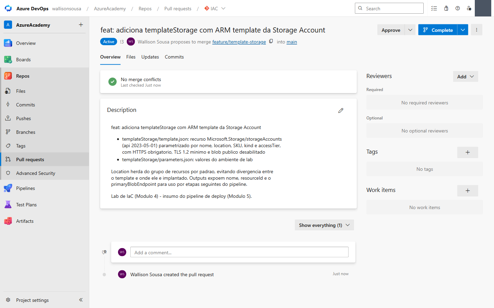
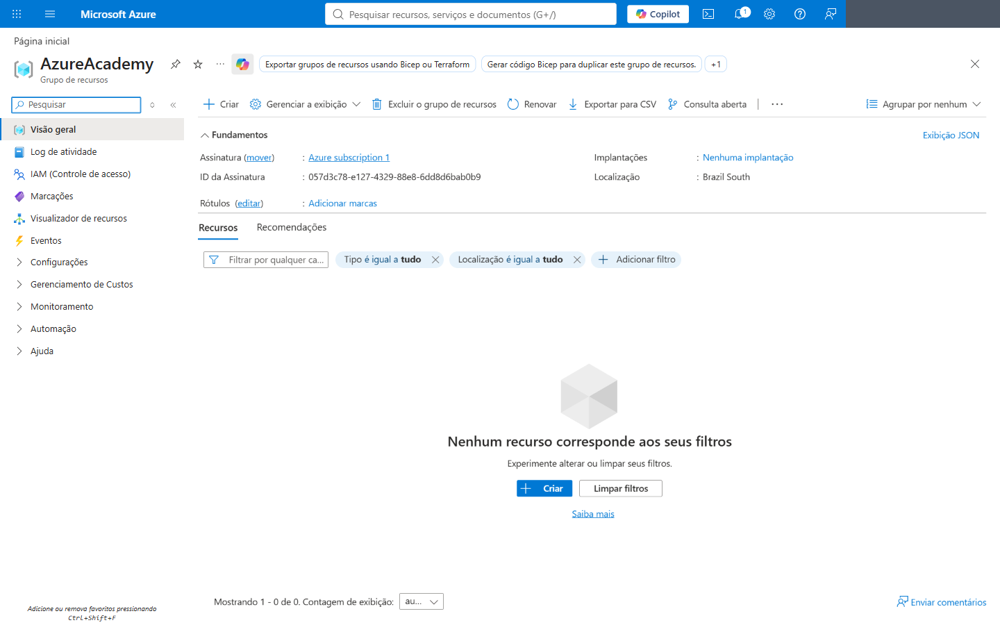

# 🧪 Módulo 4 — Infra as Code e Automações (ARM Template)

> **Tema:** Descrever infraestrutura em **JSON declarativo** e deixar o Azure Resource Manager materializá-la — com preview da mudança antes de aplicar
> **Pré-requisitos:** [Módulo 3](lab-03-repos-azure-devops-github-codespaces.md) (repositório) · assinatura Azure ativa · Azure CLI (`az`)
> **Conceitos base:** [Devops/Kubernetes](../../Kubernetes/) (o mesmo princípio declarativo em YAML), [Devops/Cloud/README.md](../README.md)
> **Curso:** Azure Academy — *Azure DevOps & GitHub*, **Turma 14** · Módulo **IAC**
> **Material:** PDF + **lab online** `labs/devops/lab-iac-arm-webapp` — *"IaC com ARM: Web App + Plan"*, 45–60 min
> **Repositório:** [`IAC`](https://dev.azure.com/wallisonsousa/AzureAcademy/_git/IAC) — pasta `templateStorage/`

---

## 🎯 Objetivo do Módulo

> *"Um arquivo descreve, o Azure constrói."*

Sair do clique no portal e passar a declarar recursos em código: **versionável, repetível e auditável**.

```
azuredeploy.json          Azure Resource Manager        Recursos no Azure
┌──────────────┐          ┌──────────────────┐          ┌─────────────────┐
│ parameters{} │          │ valida schema    │          │ App Service Plan│
│ variables{}  │  deploy  │ resolve deps     │provisiona│  (serverfarms)  │
│ resources[▸] │ ───────▶ │ ordena           │ ───────▶ │       ▼         │
│ outputs{}    │          │ aplica           │          │    Web App      │
└──────────────┘          └──────────────────┘          │     (sites)     │
                                                        └─────────────────┘
        └── what-if: prevê a mudança (＋criar / ～mudar / －remover) ANTES de aplicar
```

As 5 fases: **Escrever → Parametrizar → what-if → Deploy → Idempotência**.

> 🔗 **A ligação com o módulo anterior:** no Módulo 3 o Web App seria criado **à mão** e ligado à branch. Aqui o próprio Web App **nasce de código** — o passo que faltava para tudo ser reproduzível.

---

## 📖 As seções de um ARM Template

| Seção | Para quê |
|---|---|
| **`$schema`** | Versão da linguagem do template. Dá validação e autocomplete no editor |
| **`contentVersion`** | Sua versão do arquivo — o Azure não usa, você usa |
| **`parameters`** | O que muda **por ambiente** (nome, SKU, região) |
| **`variables`** | Valores **derivados**, calculados uma vez e reusados |
| **`resources`** | O que efetivamente será criado |
| **`outputs`** | O que o deploy **devolve** — URL, ID, endpoint |

### Os dois conceitos que sustentam tudo

**`dependsOn` — você declara a dependência, o ARM cuida da sequência.**
O Web App só é criado depois que o App Service Plan existe. Você **não** escreve a ordem; escreve a relação. O ARM monta o grafo e paraleliza o que dá.

**Idempotência — rodar duas vezes dá o mesmo resultado.**
O template descreve o **estado desejado**, não os passos. Se o recurso já está como o arquivo pede, nada é recriado. É o que diferencia declarativo de script: um script `create` roda duas vezes e falha (ou duplica); um template roda duas vezes e converge.

### `what-if` — o preview que evita o desastre

```bash
az deployment group what-if \
  --resource-group rg-iac-lab \
  --template-file azuredeploy.json \
  --parameters @dev.parameters.json
```

Mostra, **sem aplicar nada**, o que será:

| Símbolo | Significa |
|---|---|
| `+` | **Create** — recurso novo |
| `~` | **Modify** — propriedade alterada |
| `-` | **Delete** — ⚠️ recurso removido |

> ⚠️ **Ruído conhecido:** o `what-if` às vezes marca como `Modify` propriedades que **não mudam** — são defaults resolvidos só no momento do deploy. O próprio lab avisa: **foque nos `+ Create` e `- Delete`**. Um `- Delete` inesperado é sempre sinal de parar e revisar.

### Modo de deploy — o detalhe que apaga ambiente

| Modo | Comportamento |
|---|---|
| **Incremental** (padrão) | Cria e atualiza o que está no template; **não mexe** no resto do grupo |
| **Complete** | **Apaga do grupo tudo que não está no template** |

> 🚨 `Complete` é legítimo — garante que o grupo reflita exatamente o código. Mas usá-lo sem revisar o `what-if` é o caminho mais curto para apagar produção sem querer.

---

## 🧾 Execução registrada

Executado em **29/08/2026**.

### O caminho que o professor usou: o portal como autor do template

Em vez de escrever o JSON do zero, o professor **gerou os arquivos pelo `portal.azure.com`** e os colocou no repositório `IAC`, na pasta `templateStorage/`.

> 🔑 **O atalho que vale conhecer:** na tela de criação de qualquer recurso, na aba **Revisar + criar**, existe o link **"Baixar um modelo para automação"**. Ele devolve `template.json` + `parameters.json` **sem criar nada**. Você desenha no portal — onde há validação, ajuda e valores permitidos à vista — e sai com IaC pronto.
>
> O mesmo vale depois do fato: `Grupos de recursos → <grupo> → **Implantações** → Modelo` traz o template de qualquer coisa já criada.

### O que foi para o repositório

```
IAC/
└── templateStorage/
    ├── template.json      Microsoft.Storage/storageAccounts (api 2023-05-01)
    └── parameters.json    valores do ambiente de lab
```



**PR #3** · `feature/template-storage` → `main` · sem conflitos.

Parâmetros expostos: `storageAccountName`, `location`, `accountType` (SKU), `kind`, `accessTier`.

Três decisões que valem explicar:

| Decisão | Motivo |
|---|---|
| `location` = `[resourceGroup().location]` | O recurso **herda a região do grupo**. Impossível template e destino divergirem |
| `minimumTlsVersion: TLS1_2` + `supportsHttpsTrafficOnly: true` | Baseline de segurança explícito — o default da API é mais frouxo |
| `allowBlobPublicAccess: false` | Storage nasce **fechado**. Abrir vira decisão consciente, não acidente |

E os **outputs** (`storageAccountName`, `storageAccountId`, `primaryBlobEndpoint`) existem para que a **próxima etapa do pipeline** consuma o que esta criou — sem hardcode de nome ou URL.

> 📌 **Nota de proveniência:** os arquivos deste repositório foram **escritos**, não exportados — no momento da execução a assinatura estava `DisabledSubscription` e o portal recusava gerar. São funcionalmente equivalentes (mesmo recurso, mesma API). Com a assinatura ativa, vale exportar a versão do portal e comparar: ela costuma vir mais verbosa, com defaults explícitos que o ARM preencheria sozinho.

### Ligação com o Release (Módulo 6)

O template no `main` é o **insumo** da task **`AzureResourceManagerTemplateDeployment@3`** no pipeline de Release. Ela precisa de:

| Requisito | O que é |
|---|---|
| **Service Connection** (Azure Resource Manager) | A credencial do pipeline contra a assinatura |
| Resource group de destino | O escopo do deploy |
| Caminho do template e dos parâmetros | `templateStorage/template.json` e `parameters.json` |
| **Job paralelo** | Para o agente rodar — depende do grant de paralelismo ([02](02-ativar-agent-pool.md)) |

---

## 🐞 Troubleshooting Comum

| Sintoma | Causa | Correção |
|---|---|---|
| `InvalidTemplateDeployment` / `SubscriptionNotFound` | Assinatura desabilitada ou errada | `az account set --subscription "<id>"`; conferir status no portal |
| Nome do Storage recusado | **3–24 caracteres, só minúsculas e números**, único globalmente | Use um sufixo; o template já aplica `toLower()` |
| `what-if` mostra `~ Modify` em coisas que não mudei | Defaults resolvidos no deploy — ruído conhecido | Ignore; foque em `+ Create` e `- Delete` |
| Deploy apagou recursos que eu não pedi | Modo **Complete** | Use **Incremental** (padrão) e sempre rode `what-if` antes |
| `ResourceGroupNotFound` | Deploy em nível de grupo exige o grupo **já existente** | `az group create --name <rg> --location brazilsouth` |
| Web App criado antes do Plan → falha | Faltou `dependsOn` | Declare a dependência; o ARM ordena |
| Pipeline de deploy fica em fila | Sem job paralelo | Ver [02-ativar-agent-pool.md](02-ativar-agent-pool.md) |

---

## 🧠 Conceitos Aprendidos

| Conceito | Resumo |
|---|---|
| **IaC declarativo** | Descreve o **estado desejado**, não os passos |
| **Idempotência** | Rodar de novo converge, não duplica |
| **`dependsOn`** | Declara relação; o ARM deduz a ordem e paraleliza |
| **`what-if`** | Preview `+` / `~` / `-` sem aplicar |
| **Incremental × Complete** | Complete **apaga** o que não está no template |
| **`outputs`** | Como uma etapa entrega dado para a próxima |
| **`[resourceGroup().location]`** | Herdar região evita divergência |
| **Portal como autor de IaC** | *Baixar um modelo para automação* e *Implantações → Modelo* |
| **Resource group** | Escopo do deploy e fronteira de ciclo de vida |

---

## ✅ Quiz Mental

**1. Qual a diferença prática entre um script `az storage account create` e este ARM template?**

<details>
<summary>Ver resposta</summary>

**Imperativo × declarativo.**

O script descreve **passos**: rode duas vezes e ele falha (recurso já existe) ou cria duplicado. Você precisa escrever a lógica de "se já existe, pule" — e mantê-la.

O template descreve **estado**: rode quantas vezes quiser, o resultado é o mesmo. O ARM compara o que existe com o que foi declarado e aplica só a diferença. É a **idempotência**, e é ela que permite rodar o mesmo arquivo em dev, homologação e produção com parâmetros diferentes.

</details>

**2. Você rodou o deploy em modo `Complete` num grupo que tinha outros recursos. O que aconteceu?**

<details>
<summary>Ver resposta</summary>

**O ARM apagou tudo que não estava no template.** É o comportamento documentado do modo Complete: o grupo passa a refletir *exatamente* o arquivo.

Faz sentido quando o template é a **fonte única de verdade** daquele grupo. Vira desastre quando o grupo tem recursos criados por outras pessoas ou processos.

Duas defesas: usar **Incremental** (o padrão) salvo decisão consciente, e **sempre rodar `what-if` antes** — ele mostraria os `- Delete` em vermelho.

</details>

**3. Por que `location` usa `[resourceGroup().location]` em vez de um valor fixo?**

<details>
<summary>Ver resposta</summary>

Para o recurso **herdar a região do grupo** onde está sendo implantado, em vez de carregar uma região fixa no arquivo.

Com valor fixo, um template implantado num grupo de outra região cria o recurso **longe do grupo** — o que gera latência entre recursos que deveriam ser vizinhos, e pode violar requisito de residência de dados.

Herdando, o mesmo arquivo funciona em qualquer região sem edição: quem decide é o **destino**, não o template.

</details>

---

## 🗺️ Status do Roadmap

| Fase | O que é | Status |
|---|---|---|
| 1 · **Escrever** | Template JSON com o recurso | ✅ `templateStorage/template.json` |
| 2 · **Parametrizar** | Arquivo de parâmetros por ambiente | ✅ `templateStorage/parameters.json` |
| 3 · **Grupo de recursos** | O destino da implantação | ✅ `AzureAcademy` · Brazil South · 30/08/2026 |
| 4 · **what-if** | Preview da mudança | 🔜 |
| 5 · **Deploy** | Aplicar e ler os outputs | 🔜 |
| 6 · **Exportar do portal** | *Implantações → Modelo* → comparar com o escrito à mão | 🔜 |
| 7 · **Idempotência** | Rodar de novo e provar que nada muda | 🔜 |

### ✅ Etapa 0 — o grupo de recursos (30/08/2026)

O `AzureAcademy` foi criado. É o contêiner onde tudo do curso vai morar — e, mais importante para este lab, **é dele que sai o ARM template**: o menu *Implantações* de um grupo guarda o histórico de cada implantação e o modelo que o portal gerou.

| Campo | Valor |
|---|---|
| Nome | `AzureAcademy` |
| Assinatura | `Azure subscription 1` (`057d3c78-…`) |
| Região | **Brazil South** — a mesma da organização do Azure DevOps |
| Implantações | *Nenhuma implantação* — ainda |



> 💡 **Um grupo de recursos vazio custa R$ 0.** Ele não é um recurso cobrável — é só um limite de ciclo de vida e de RBAC. O que custa é o que vive dentro dele.

> 🔑 **Repare no “Nenhuma implantação”.** Criar o *grupo* não gera implantação — a criação de um resource group é uma operação de **escopo de assinatura**, não de grupo. A primeira linha do histórico só aparece quando o primeiro recurso nascer ali dentro. É exatamente esse histórico que vira o ARM exportado na Etapa 6.

### 🔜 Onde a aula parou

Pendências, agora executáveis:

1. ~~Grupo de recursos `AzureAcademy`~~ — ✅ **feito em 30/08/2026**
2. **Web App do `meu-hello-app`** (Node 22 LTS, Linux, Brazil South, **F1 gratuito**) + Deployment Center → link no ar
3. **Exportar o ARM** de *Implantações → Modelo* e comparar com o `templateStorage/template.json` escrito à mão
4. **`what-if` + deploy** do `templateStorage` via `az deployment group`
5. **Release pipeline** com a task *ARM Template Deployment* (Módulo 6)

> ✅ **O grant de paralelismo deixou de ser bloqueio** — há **1 job Microsoft-hosted comprado** na organização, então o pipeline roda. Ele **custa** (~US$ 40/mês, cobrança diária pró-rata): ver a seção de Custos no [README](README.md).

> ⚠️ **Armadilha de custo no formulário do Web App:** o **Plano de preços** vem pré-selecionado em **Premium V3 P0V3 — US$ 81,03/mês**. O lab pede **F1 (Gratuito, US$ 0,00)**, e trocar exige abrir o dropdown *Plano de preços* e subir até o primeiro item. Quem clica *Revisar + criar* no default paga Premium sem perceber.

---

---

## 📚 Leitura complementar

| Livro | Onde | Por quê |
|---|---|---|
| **#09** *Implementing Azure DevOps Solutions* | cap. 6 — Infrastructure and Configuration as Code | ARM, Bicep e o conceito de idempotência |
| **#07** *Practical Microsoft Azure IaaS* | cap. 7 — Automated Provisioning | Provisionamento automatizado na prática |
| **#02** *Azure for Architects* | cap. 2 — Azure Design Patterns | Padrões que o template deveria seguir |

> Acervo completo e critério de uso em **[bibliografia.md](bibliografia.md)**. Os arquivos ficam em `materiais/livros/`, fora do controle de versão.

## 🔗 Conexões

| Tema | Onde |
|---|---|
| Índice da formação | [README.md](README.md) |
| Como dirigir o portal | [00-guia-navegacao-mcp.md](00-guia-navegacao-mcp.md) |
| Repositórios e PR | [lab-03-…](lab-03-repos-azure-devops-github-codespaces.md) |
| Agent pool / paralelismo | [02-ativar-agent-pool.md](02-ativar-agent-pool.md) |
| Declarativo em outro contexto | [Devops/Kubernetes](../../Kubernetes/) |

---

## 💡 Reflexão Final

O módulo se vende como "escrever JSON", mas o que ele realmente instala é uma mudança de pergunta: sai o *"quais passos eu executo?"* e entra o *"como o mundo deve estar?"*. O ARM resolve o resto — ordem, paralelismo, o que já existe.

É o mesmo salto que o [Kubernetes](../../Kubernetes/) faz com manifesto YAML, e que o Terraform faz com HCL: você para de operar a infraestrutura e passa a **descrevê-la**. O ganho não é digitar menos — é que o arquivo vira a fonte de verdade, revisável em Pull Request e com histórico em Git. Infraestrutura entra no mesmo fluxo de revisão do código, que é o ponto onde DevOps deixa de ser discurso.

E há uma ironia útil no caminho que o professor usou: **a forma mais rápida de escrever IaC é clicar no portal e exportar**. A ferramenta que o IaC veio substituir é a melhor ferramenta para escrevê-lo — porque o portal conhece os defaults, os valores válidos e o schema da API. Usar o clique como rascunho e o template como entrega é pragmatismo, não contradição.
