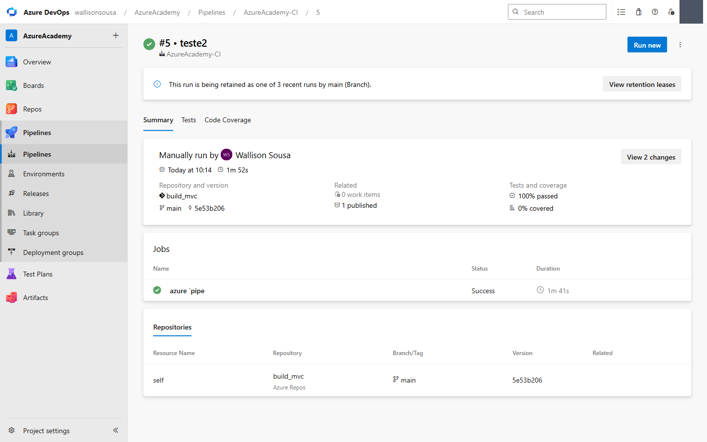

# 🏗️ Lab 05 — Pipelines: consertando um build clássico quebrado

> **Tema:** Azure Pipelines (editor clássico), MSBuild, .NET Framework, artefatos de build
> **Pré-requisitos:** [Lab 03 — Repos](lab-03-repos-azure-devops-github-codespaces.md) · [02 — Agent Pool e jobs paralelos](02-ativar-agent-pool.md)
> **Conceitos base:** agente hospedado · imagem do agente · targeting pack · argumentos MSBuild · variáveis de pipeline · gatilho de CI
> **Curso:** Azure Academy — Azure DevOps & GitHub · Módulo 5 (Pipelines — Builds)
> **Executado em:** 30/08/2026 · organização `dev.azure.com/wallisonsousa` · projeto `AzureAcademy`

---

## 🎯 Objetivo do Lab

A pipeline **`AzureAcademy-CI`** do repositório **`build_mvc`** (uma solução ASP.NET MVC clássica, .NET Framework) estava **vermelha**. O objetivo aqui não é criar uma pipeline do zero — é **ler o log, achar a causa raiz e consertar**, que é o que se faz 90% do tempo na vida real.

**Resultado:** run **#5 verde** em 1m52s, 100% dos testes passando e um artefato `drop` de **9,1 MB** com o pacote de Web Deploy.



---

## 🔍 Etapa 1 — Ler o log pela API, não pela tela

O portal é uma SPA pesada. Para diagnóstico, a **API REST** dá tudo de uma vez e é muito mais rápida de ler:

```bash
# quais passos rodaram, o que falhou e qual a mensagem
GET https://dev.azure.com/{org}/{projeto}/_apis/build/builds/{buildId}/timeline?api-version=7.1

# o log bruto de um passo específico (o logId vem do timeline)
GET https://dev.azure.com/{org}/{projeto}/_apis/build/builds/{buildId}/logs/{logId}?api-version=7.1

# a definição inteira da pipeline, com todos os inputs de cada task
GET https://dev.azure.com/{org}/{projeto}/_apis/build/definitions/{definitionId}?api-version=7.1
```

> 💡 O `timeline` traz um array `issues` por task, já com a mensagem de erro. É o caminho mais curto entre "falhou" e "por quê".

O `timeline` do run **#3** mostrou a forma clássica de uma falha de build .NET Framework:

| # | Passo | Resultado |
|---|---|---|
| 1–5 | Initialize · Checkout · Use NuGet · **NuGet restore** | ✅ |
| **6** | **Build solution `**\*.sln`** | ❌ **falhou em 8s** |
| 7–9 | VsTest · Publish symbols · Publish Artifact | ⏭️ pulados |

> 🔑 **Passo pulado não é passo que passou.** Quando um passo falha, os seguintes ficam `skipped` — e o artefato nunca nasce. Sempre leia de cima para baixo e pare no **primeiro** vermelho.

---

## 🐛 Etapa 2 — Defeito nº 1: targeting pack que não existe mais

```text
C:\Program Files\Microsoft Visual Studio\2022\Enterprise\MSBuild\Current\Bin\
Microsoft.Common.CurrentVersion.targets(1259,5): error MSB3644:
The reference assemblies for .NETFramework,Version=v4.6.1 were not found.
To resolve this, install the Developer Pack (SDK/Targeting Pack) for this
framework version or retarget your application.
```

Os dois projetos da solução declaram:

```xml
<TargetFrameworkVersion>v4.6.1</TargetFrameworkVersion>
```

E o agente da pipeline é o **`windows-latest`** — imagem que a Microsoft **parou de empacotar com os targeting packs antigos**. Hoje ela traz o 4.8 e o 4.8.1; 4.5.x a 4.7.x saíram.

> 🧠 **Compilar ≠ executar.** O .NET Framework 4.8 é compatível *para trás* com o 4.6.1 em tempo de execução, mas **para compilar** o MSBuild precisa das *reference assemblies* exatas da versão declarada. O runtime está lá; o kit de compilação é que não.

**Três saídas possíveis:**

| Saída | Veredito |
|---|---|
| Fixar a imagem em `windows-2019` | ❌ imagem **aposentada** no Azure Pipelines |
| `choco install netfx-4.6.1-devpack` num passo antes do build | 🟡 funciona, mas custa ~2–3 min por execução |
| **Compilar contra o 4.8** via `/p:TargetFrameworkVersion=v4.8` | ✅ **escolhida** — zero custo, é a segunda opção que a própria mensagem de erro sugere |

> ⚠️ **Isto é um paliativo consciente.** O `-p:` força o alvo só na pipeline; o `.csproj` continua dizendo `v4.6.1`, e o build local diverge do build de CI. A correção definitiva é **retargetar os `.csproj` para `v4.8`** (mais o `targetFramework` do `Web.config`) — vale um PR próprio.

---

## 🐛 Etapa 3 — Defeito nº 2: argumentos MSBuild na task errada

Este só apareceu ao ler a **definição** da pipeline, não o log. A task **`Publish symbols path`** estava com isto no campo **Search pattern**:

```text
/p:DeployOnBuild=true /p:WebPublishMethod=Package /p:PackageAsSingleFile=true
/p:SkipInvalidConfigurations=true /p:PackageLocation="$(build.artifactstagingdirectory)\\"
```

Isso é **argumento de MSBuild colado no campo de "padrão de busca de arquivos PDB"**. E o campo **MSBuild Arguments** da task `Build solution`, onde eles deveriam estar, estava **vazio**.

Consequência em cascata:

1. Sem `DeployOnBuild=true`, o MSBuild compila mas **não gera o pacote** de Web Deploy
2. Sem `PackageLocation`, nada é escrito em `$(Build.ArtifactStagingDirectory)`
3. `Publish Artifact: drop` publica **uma pasta vazia**

Ou seja: mesmo que o build passasse, a pipeline entregaria **um artefato de 0 byte** — o pior tipo de falha, a que fica verde.

**Correção:** mover os argumentos para o campo certo e **desativar** a `Publish symbols path` (o lab não precisa de symbol server, e ela só existia por ser padrão do template).

---

## 🐛 Etapa 4 — Defeito nº 3: variáveis inexistentes

A definição referenciava `$(BuildConfiguration)` (no nome do artefato de símbolos), mas a aba **Variables** só tinha as `system.*`. Uma variável não definida vira **string vazia** — silenciosamente.

Adicionadas:

| Nome | Valor | Para quê |
|---|---|---|
| `BuildConfiguration` | `Release` | `/p:configuration` do MSBuild |
| `BuildPlatform` | `Any CPU` | `/p:platform` do MSBuild |

E os campos **Platform** e **Configuration** da task `Build solution` passaram a apontar para elas — em vez de ficarem vazios.

> 💡 **Por que variável e não valor fixo?** Porque a mesma definição vira matriz depois (`Debug`/`Release`, `x86`/`x64`) mudando **um lugar só**. É a diferença entre configuração e código duplicado.

---

## 🐛 Etapa 5 — Defeito nº 4: sem gatilho de CI

Aba **Triggers** → `build_mvc` estava **Disabled**. A pipeline só rodava quando alguém clicava em *Run*.

Uma pipeline que não dispara sozinha **não é integração contínua** — é um script manual com interface bonita. Ativado **Enable continuous integration** com filtro de branch `Include main`.

---

## 🔧 Etapa 6 — A pegadinha da barra invertida

Primeira tentativa de correção, e o build falhou de novo — **mas com erro diferente**, o que já é progresso:

```text
MSBUILD : error MSB1008: Only one project can be specified.
```

Olhando a linha de comando que o agente montou:

```text
/p:PackageLocation="D:\a\1\a\" /p:TargetFrameworkVersion=v4.8 /p:platform="Any CPU" ...
                            ↑
                 esta barra escapou a aspa
```

Eu tinha digitado `...artifactstagingdirectory)\"` com **uma** barra. No parser de linha de comando do Windows, `\"` é uma **aspa literal escapada** — então a string nunca fecha, e todo o resto vira parte do mesmo argumento. O MSBuild recebeu um monte de lixo colado e reclamou que havia "mais de um projeto".

Prova no próprio log, na seção de switches:

```text
Switch: CPU /p:configuration=Release /p:VisualStudioVersion=17.0 ...
```

O `Any CPU` foi partido ao meio: o `Any ` ficou dentro da string quebrada e o `CPU` virou um switch solto.

**Correção:** duas barras.

```text
/p:PackageLocation="$(build.artifactstagingdirectory)\\"
```

> 🔑 **Por isso o template oficial da Microsoft usa `\\`.** Não é enfeite — é escape do escape. Sempre que um argumento MSBuild terminar em caminho de diretório, dobre a barra final.

---

## ✅ Etapa 7 — Configuração final

**Task `Build solution **\*.sln`** (Visual Studio build):

| Campo | Valor |
|---|---|
| Solution | `**\*.sln` |
| Visual Studio Version | `Latest` |
| **MSBuild Arguments** | `/p:DeployOnBuild=true /p:WebPublishMethod=Package /p:PackageAsSingleFile=true /p:SkipInvalidConfigurations=true /p:PackageLocation="$(build.artifactstagingdirectory)\\" /p:TargetFrameworkVersion=v4.8` |
| **Platform** | `$(BuildPlatform)` |
| **Configuration** | `$(BuildConfiguration)` |

**Task `Publish symbols path`** → **desativada** (Control Options → Enabled desmarcado).

**Variables** → `BuildConfiguration=Release` · `BuildPlatform=Any CPU`.

**Triggers** → CI ligado, filtro `Include main`.

### Resultado

| Run | O que mudou | Resultado |
|---|---|---|
| **#3** | estado original | ❌ `MSB3644` em 8s |
| **#4** | args no lugar certo + `v4.8`, mas com `\` simples | ❌ `MSB1008` — aspa escapada |
| **#5** | `\\` na `PackageLocation` | ✅ **verde em 1m52s** |

```text
Initialize job          ✅
Checkout build_mvc@main ✅
Use NuGet               ✅
NuGet restore           ✅
Build solution          ✅
VsTest                  ✅  100% passed
Publish Artifact: drop  ✅  9.557.745 bytes
```

O artefato `drop` com **9,1 MB** é o pacote de Web Deploy — é exatamente ele que a etapa de **Release** vai consumir para publicar no App Service.

---

## 🐞 Troubleshooting Comum

| Sintoma | Causa provável | Como confirmar |
|---|---|---|
| `MSB3644 ... reference assemblies ... were not found` | Targeting pack ausente na imagem do agente | Compare o `<TargetFrameworkVersion>` do `.csproj` com o que a imagem oferece |
| `MSB1008: Only one project can be specified` | Aspas quebradas nos argumentos MSBuild — quase sempre `\"` no fim de um caminho | Leia a linha `##[command]` no log e a seção `Switches appended by response files` |
| Build verde mas artefato vazio | `DeployOnBuild`/`PackageLocation` ausentes, ou no campo errado | `GET /_apis/build/definitions/{id}` e confira `inputs` de cada task |
| Pipeline nunca dispara sozinha | Trigger de CI desabilitado | Aba **Triggers** — o repositório aparece como `Disabled` |
| Variável referenciada resolve vazio | Não existe na aba Variables | Variável indefinida **não** dá erro: vira string vazia |
| `No hosted parallelism has been purchased or granted` | Sem job paralelo | Ver [02 — Agent Pool](02-ativar-agent-pool.md) |

---

## 🧠 Conceitos Aprendidos

- **Imagem do agente é dependência, não detalhe.** `windows-latest` é um alvo móvel: o que existe nela hoje pode sumir amanhã. Projeto legado + imagem "latest" é uma combinação que quebra sozinha com o tempo.
- **Compilar e executar pedem coisas diferentes.** Runtime compatível para trás não substitui as *reference assemblies* da versão declarada.
- **O campo errado não dá erro.** Argumentos MSBuild num campo de search pattern são aceitos sem reclamação — a pipeline fica verde entregando nada. Ler a **definição** é tão importante quanto ler o **log**.
- **Falhar diferente é progresso.** Sair de `MSB3644` para `MSB1008` significa que o primeiro problema morreu. Em depuração de pipeline, mudar a mensagem de erro é avançar.
- **Escape de barra invertida.** `\"` no fim de um argumento é aspa literal, não barra + fecha-aspas. Daí o `\\` do template oficial.
- **API REST > interface** para diagnóstico. `timeline` + `logs/{id}` + `definitions/{id}` respondem em segundos o que a SPA leva minutos para mostrar.

---

## ✅ Quiz Mental

<details>
<summary>O plano F1 é gratuito e o build falhou por quota. Isso é contradição?</summary>

**Não.** Quota e cobrança são trilhos separados na Azure. Um plano F1 custa US$ 0,00 mas ainda **reserva** capacidade de computação — e reserva conta contra a quota de vCPU da assinatura. É a mesma lógica do grant de paralelismo do Pipelines ser independente do pagamento. Ver [lab-03](lab-03-repos-azure-devops-github-codespaces.md).

</details>

<details>
<summary>Por que não usar <code>choco install netfx-4.6.1-devpack</code> e manter o projeto em 4.6.1?</summary>

Funciona, e é a resposta certa quando você **não pode** mexer no alvo do projeto (dependência binária que só existe para 4.6.1, requisito de homologação, etc.). O custo é ~2–3 min em *toda* execução, mais a fragilidade de depender de um pacote Chocolatey de terceiro no meio do CI.

Como aqui é uma app MVC comum, compilar contra 4.8 é mais barato e mais duradouro.

</details>

<details>
<summary>Se o build ficasse verde mas o artefato viesse vazio, o que quebraria — e quando?</summary>

Nada quebraria **agora**. A quebra apareceria no **Release**, ao tentar publicar um pacote que não existe — longe da causa, provavelmente com uma mensagem sobre arquivo não encontrado.

É o padrão mais caro de depurar: a falha se manifesta a vários passos de distância de onde nasceu. Por isso vale sempre conferir o **tamanho** do artefato, não só o ✅.

</details>

<details>
<summary>Por que <code>$(BuildPlatform)</code> em vez de escrever <code>Any CPU</code> direto no campo?</summary>

Porque no dia em que a pipeline precisar compilar `x86` **e** `x64`, você muda a variável (ou vira matriz) em **um** lugar, em vez de caçar o valor espalhado por cada task. Variável de pipeline é o mesmo princípio de não repetir constante mágica no código.

</details>

---

## 🗺️ Status do Roadmap

| Fase | O que é | Status |
|---|---|---|
| 1 · **Diagnosticar** | Ler timeline, log e definição pela API | ✅ |
| 2 · **Targeting pack** | `/p:TargetFrameworkVersion=v4.8` | ✅ paliativo aplicado |
| 3 · **Argumentos MSBuild** | Mover para a task `Build solution` | ✅ |
| 4 · **Variáveis** | `BuildConfiguration` · `BuildPlatform` | ✅ |
| 5 · **Gatilho de CI** | Ligado, filtro `main` | ✅ |
| 6 · **Build verde + artefato** | Run #5, `drop` 9,1 MB | ✅ |
| 7 · **Retargetar os `.csproj` para v4.8** | PR no `build_mvc`, tirando o paliativo | 🔜 |
| 8 · **Release** | Consumir o `drop` e publicar no App Service | 🔜 — depende da [quota](lab-03-repos-azure-devops-github-codespaces.md) |
| 9 · **Migrar para YAML** | `azure-pipelines.yml` versionado no repo | 🔜 |

---

## 🔗 Conexões

| Tema | Onde |
|---|---|
| Índice da formação | [README.md](README.md) |
| Jobs paralelos e billing | [02-ativar-agent-pool.md](02-ativar-agent-pool.md) |
| Repos, PRs e o bloqueio de quota | [lab-03](lab-03-repos-azure-devops-github-codespaces.md) |
| IaC com ARM | [lab-04](lab-04-iac-arm-e-automacoes.md) |
| O mesmo problema com Jenkins | [Devops/Jenkins](../../Jenkins/README.md) |
| Qualidade e testes no pipeline | [Devops/SonarQube](../../SonarQube/), [Devops/TDD](../../TDD/) |

---

## 💡 Reflexão Final

Nenhum dos quatro defeitos era difícil. O que os tornava difíceis era **onde** eles se escondiam: um no log, um na definição, um numa aba lateral e um numa barra invertida.

A lição prática é a ordem de investigação. **Log primeiro** — ele diz o que quebrou. **Definição depois** — ela diz o que está errado mas ainda não quebrou. O terceiro defeito (artefato vazio) nunca teria aparecido num log, porque não era um erro: era a pipeline fazendo obedientemente o que mandaram, que por acaso era nada.

E o `MSB1008` merece um parágrafo. Uma barra a mais ou a menos derrubou o build inteiro com uma mensagem — "*only one project can be specified*" — que não tem relação nenhuma com a causa. Quando o erro parecer absurdo, leia a **linha de comando literal** que a ferramenta montou. Ela raramente mente.
