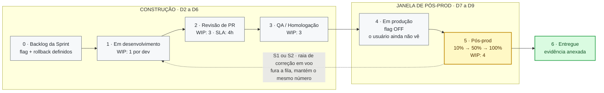
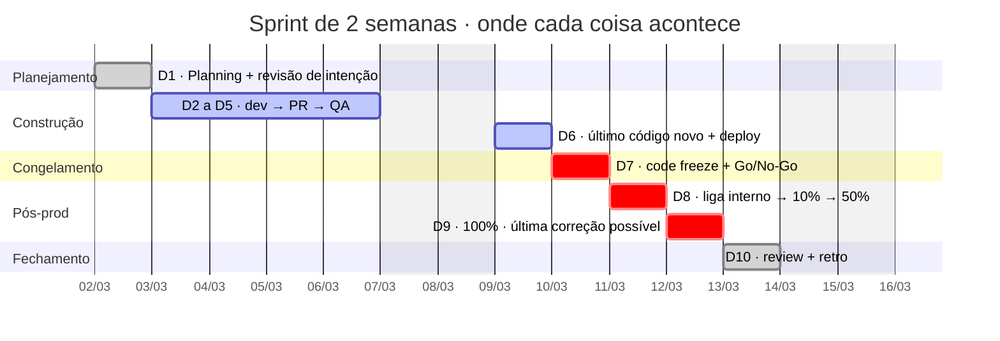
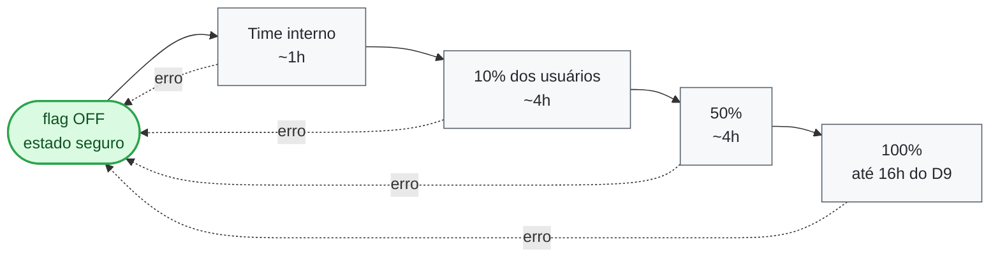
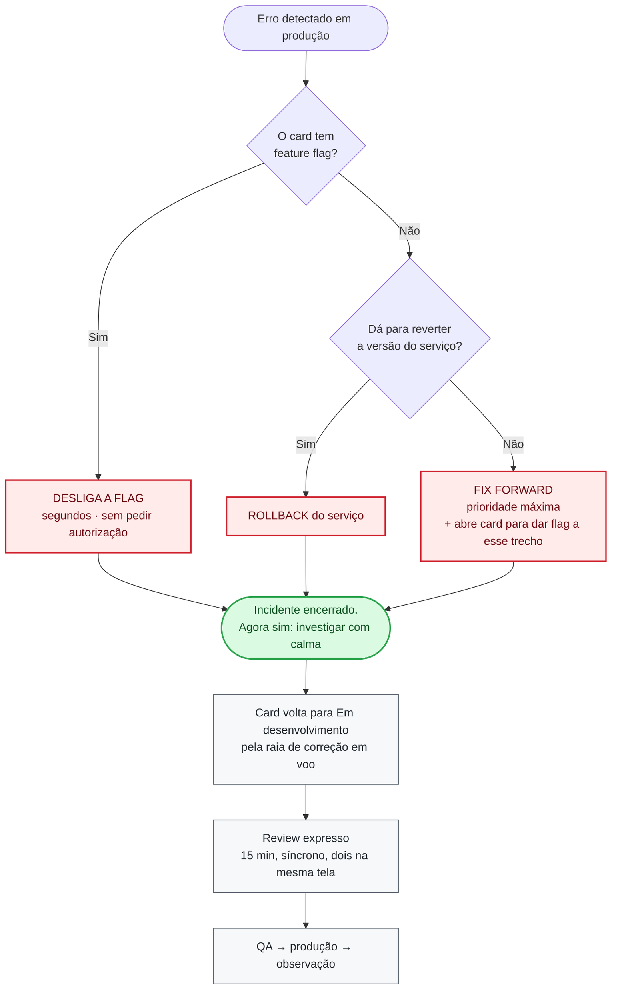

# Board de Entrega — sprint de 2 semanas com janela de pós-produção

> O board tem um único objetivo: deixar **barato errar em produção**.
> Ele mostra, para cada entrega, **o que o usuário ganhou** e **o que o time construiu**, e reserva os últimos dias da sprint para observar isso rodando de verdade e corrigir a tempo.

**Mapa mental para apresentar:** [board-de-entrega.excalidraw](board-de-entrega.excalidraw) — abra em [excalidraw.com](https://excalidraw.com/) pelo menu **☰ → Abrir** (`Ctrl+O`).

---

## 1. A ideia em uma frase

Nenhum card é considerado entregue por estar "em produção". Ele é entregue quando **sobreviveu à janela de pós-prod**: rodou com usuário real, sob observação, e o time teve tempo de sprint sobrando para consertar se quebrasse.

Três mecanismos sustentam isso:

| Mecanismo | Para que serve |
| :--- | :--- |
| **Feature flag em todo card** | O botão de desfazer. Erro em prod vira "desliga a chave", não "reunião de emergência". |
| **Code freeze no dia 7** | Cria os dias de folga no fim da sprint. Sem freeze, não existe janela de correção. |
| **Buffer de ~20% da capacidade** | O tempo que o time *não* planejou usar — é dele que sai a correção. |

> **Notação usada no documento:** `D1` a `D10` são os **10 dias úteis** da sprint, contados a partir do planning. Com a sprint começando numa segunda: semana 1 = D1 (seg) a D5 (sex); semana 2 = D6 (seg) a D10 (sex). Sábado e domingo não contam. O calendário completo está no §5.

---

## 2. O board



| # | Coluna | O que significa | WIP sugerido | Só sai quando |
| :-- | :--- | :--- | :--- | :--- |
| 0 | **Backlog da Sprint** | Escopo fechado no planning. Já nasce com flag e plano de rollback definidos. | — | Tem dono e cumpre o DoR (§7) |
| 1 | **Em desenvolvimento** | Código sendo escrito, com draft PR aberto desde o primeiro commit. | 1 por dev | PR marcado como pronto e pipeline verde |
| 2 | **Revisão (PR)** | O portão que garante que o card é **reversível** (§4). | 3 | Aprovado e mergeado. **SLA: primeira resposta em 4h** |
| 3 | **QA / Homologação** | Validado fora de produção. | 3 | Critério de aceite ok em staging |
| 4 | **Em produção — flag OFF** | O código **já está em prod**, o usuário ainda não vê. | — | A flag começou a ser ligada |
| 5 | **Pós-prod (observação)** | Flag ligando em etapas, com métrica sendo olhada. | 4 | 100% ligado + janela de observação cumprida sem S1/S2 |
| 6 | **Entregue** | Aceito, com evidência anexada. | — | — |

**Por que separar "Em prod — flag OFF" de "Pós-prod":** deploy e liberação viram duas decisões diferentes. Subir código é rotina e pode acontecer todo dia; liberar para o usuário é um ato consciente, feito em horário escolhido, com alguém olhando.

**Regra de WIP:** se uma coluna estoura o limite, ninguém puxa card novo — o time vai ajudar quem está travado. É isso que impede o board de chegar no dia 9 com dez coisas pela metade.

---

## 3. Anatomia do card

Todo card responde às duas perguntas centrais — **a funcionalidade** (o que mudou para quem usa) e **a funcionalidade técnica** (o que passou a existir no sistema):

```markdown
### [FEAT-142] Rastrear entregador no mapa

**Funcionalidade (o usuário vê):**
O cliente acompanha a posição do entregador em tempo real na tela do pedido.

**Funcionalidade técnica (o time construiu):**
- `tracking-service`: novo endpoint GET /orders/{id}/position
- consumidor do tópico driver.position.updated
- migração aditiva V37__driver_position.sql

**Dono:** @fulano  ·  **Squad:** Delivery  ·  **Revisor:** @ciclana

**Feature flag:** delivery.live-tracking (default OFF)
**Rollback:** desligar a flag. A migração é aditiva — banco não precisa ser revertido.

**Critério de aceite:** a posição atualiza em ≤ 5s para 95% dos pedidos ativos.
**Evidência:** painel "live-tracking p95" + print do app com o pedido real #88213

**Status pós-prod:** flag em 10% desde 12/03 14h — 0 erro em 1.2k pedidos
```

Os quatro blocos obrigatórios e o motivo de cada um:

| Bloco | Por que é obrigatório |
| :--- | :--- |
| Funcionalidade + funcionalidade técnica | O negócio lê a primeira e entende a entrega; o time lê a segunda e sabe onde mexer quando quebrar às 2h da manhã. |
| Feature flag + rollback | **Escrito antes do código**, não depois do incidente. Card sem plano de volta não entra no board. |
| Critério de aceite + evidência | Sem isso, "pronto" vira opinião. A evidência é o que você mostra na review. |
| Dono + squad + revisor | Alguém tem nome para acompanhar a flag subindo — e o revisor é definido no D1, não sorteado quando o PR abre. |

---

## 4. Code review — onde entra e por que sustenta a pós-prod

### Por que ele é o pilar silencioso deste board

A janela de pós-prod só é segura porque o que chega lá é **reversível**. E quem verifica isso é o revisor.

O review neste board não pergunta apenas "esse código está bom?". Ele pergunta **"dá para desligar isso às 3h da manhã?"**. Se um card passar sem flag, com migração destrutiva ou sem nenhum log, o time até vai descobrir o erro no D8 — mas não vai ter como estancar. O custo de errar volta a ser alto e o desenho inteiro da sprint cai junto.

Dito de outro modo: **o review é o guardião do DoR e do DoD** (§7). Ele é o único ponto do fluxo em que alguém olha o código com a pergunta "isso volta atrás?" ainda a tempo.

### O custo de achar o erro em cada etapa

| Onde o erro aparece | Custo relativo | Quem paga a conta |
| :--- | :--- | :--- |
| Conversa de intenção (D1) | **1x** | 15 minutos de duas pessoas |
| Draft PR, durante o dev | ~5x | Refatorar algo que ainda não terminou |
| PR final | ~10x | Reescrever trecho pronto + novo ciclo de review |
| QA / homologação | ~30x | Card volta duas colunas e ameaça o calendário |
| Pós-prod | ~100x | Incidente, correção sob pressão, confiança do usuário |

O objetivo do review não é eliminar o erro — é **movê-lo para a esquerda**, onde ele é barato.

### Os quatro momentos de revisão

Review não é um evento único antes do merge. São quatro, e os dois primeiros são os que o time normalmente pula:

| # | Momento | Quando | Formato | Saída |
| :-- | :--- | :--- | :--- | :--- |
| 1 | **Revisão de intenção** | D1, no planning | 15min, duas pessoas, antes de existir código | Flag nomeada e rollback escrito no card |
| 2 | **Draft PR** | Do primeiro commit em diante | Assíncrono, contínuo | Revisor acompanha e não é surpreendido no fim |
| 3 | **Review canônico** | Antes do merge | O portão. Checklist abaixo | Aprovado → QA |
| 4 | **Review expresso** | Correção em voo (§6) | 15min, síncrono, dois na mesma tela | Fix aprovado para prod |

```mermaid
flowchart LR
    P["D1 · Planning"] --> R1{{"1 · Revisão de intenção<br/>15 min, antes do código<br/>erro custa 1x"}}
    R1 --> DEV["D2 a D6 · Desenvolvimento"]
    DEV --> R2{{"2 · Draft PR<br/>contínuo, assíncrono<br/>erro custa ~5x"}}
    R2 --> PRONTO["PR pronto"]
    PRONTO --> R3{{"3 · Review canônico<br/>o portão, antes do merge<br/>erro custa ~10x"}}
    R3 --> QA["QA → produção"]
    QA --> POS["D8 e D9 · Pós-prod"]
    POS -->|"deu S1 ou S2"| R4{{"4 · Review expresso<br/>15 min, síncrono<br/>erro custa ~100x"}}
    R4 --> POS
    POS --> FIM(["Entregue"])

    classDef review fill:#ddf4ff,stroke:#0969da,stroke-width:2px,color:#032f62
    classDef fase fill:#f6f8fa,stroke:#57606a,stroke-width:1px,color:#24292f
    classDef ok fill:#dafbe1,stroke:#2da44e,stroke-width:2px,color:#0f5323
    class R1,R2,R3,R4 review
    class P,DEV,PRONTO,QA,POS fase
    class FIM ok
```



**Momento 1 é o de maior retorno e o mais ignorado.** As perguntas são simples: *como se desliga isso? o que acontece se só metade rodar? precisa de migração? qual contrato muda?* Quinze minutos ali evitam um incidente no D8 — e é literalmente o que preenche os campos de flag e rollback do card.

**Momento 2 muda a natureza do review.** Comentário em rascunho é sugestão barata; comentário em código "pronto" é retrabalho e vira discussão defensiva. A qualidade técnica do comentário é a mesma — o que muda é o custo de acatá-lo.

E existe um quinto, que quase ninguém faz: **reler na retro (D10) o código que causou incidente**. Não para achar culpado — para descobrir qual pergunta faltou no checklist.

### Checklist do revisor neste board

Além de tudo que já se revisa normalmente (lógica, testes, legibilidade), estes cinco itens são específicos do modelo com pós-prod:

- [ ] **A flag existe e o caminho OFF foi testado?** Não basta a flag estar no código — o comportamento antigo precisa continuar funcionando com ela desligada. Flag não testada é flag que não existe.
- [ ] **O rollback descrito no card é verdade?** Migração destrutiva, escrita em fila nova ou cache com formato novo matam o rollback silenciosamente.
- [ ] **Dá para observar isso em produção?** Log, métrica ou trace que permita responder "está funcionando?" com a flag em 10%.
- [ ] **Mudança de contrato é retrocompatível?** Em microsserviços, consumidor antigo com produtor novo tem de continuar funcionando durante a liberação gradual.
- [ ] **O PR cabe na cabeça de uma pessoa?** Acima de ~400 linhas a taxa de detecção de defeito despenca e o review vira carimbo. Peça para quebrar.

### SLA de review — o gargalo que come a janela

Card parado em "Revisão" é a causa mais comum de sprint espremida: empurra tudo para a direita e a pós-prod é a primeira coisa a ser sacrificada.

| Regra | Valor |
| :--- | :--- |
| Primeira resposta em um PR aberto | Até **4h úteis** |
| Prioridade | **Revisar vem antes de escrever código novo** — revisar desbloqueia outra pessoa |
| PR parado há mais de 1 dia | Vira assunto obrigatório da daily |
| A partir do D6 | Review **síncrono**: ninguém espera resposta assíncrona perto do freeze |

> A inversão de prioridade aqui é deliberada e costuma gerar resistência: parar o próprio código para revisar o do colega parece perda de produtividade individual. É ganho de vazão do time — o board mede entrega, não linhas escritas.

### Review na correção em voo

É o momento mais contraintuitivo do fluxo: **a correção urgente é onde mais se pula o review e onde ele mais importa.** Time com pressa, contexto quebrado, muitas vezes alguém mexendo em código que não é seu.

A regra que separa as duas coisas:

```
ESTANCAR  → não precisa de review, não precisa de autorização
            (desligar a flag, dar rollback — ações reversíveis por natureza)

CORRIGIR  → precisa de review, sempre
            (15 min, síncrono, duas pessoas na mesma tela)
```

Nunca se troca review por velocidade na correção. Troca-se **assíncrono por síncrono** — o tempo cai de horas para minutos sem abrir mão do segundo par de olhos.

---

## 5. A janela de pós-prod (o coração do board)

### Calendário dos 10 dias úteis

| Dia | Fase | O que acontece |
| :--- | :--- | :--- |
| **D1** | Planning | Fecha escopo. Cada card sai com flag nomeada e rollback escrito. Capacidade planejada: **80%**. |
| **D2–D5** | Construção | Fluxo normal: dev → PR → QA. O que passa em QA já pode ir para prod com a flag OFF. |
| **D6** | Construção + deploy | Último dia de código novo. Sobe tudo que está pronto (flag OFF). |
| **D7** | **Code freeze** | Nada novo entra no board. Deploy final da sprint. A partir daqui, só correção. |
| **D8** | **Pós-prod — dia 1** | Liga as flags em etapas: time interno → 10% → 50%. Observa. Corrige. |
| **D9** | **Pós-prod — dia 2** | 100% ligado. **Último dia útil para subir correção.** |
| **D10** | Fechamento | Review com as evidências, retro, e o que não estabilizou volta para o backlog. |



> **A folga para errar está no D8 e no D9.** São dois dias inteiros em que o time não tem card novo planejado. É isso — e só isso — que permite errar na terça e entregar corrigido na quinta.

### Liberação em etapas (dentro do D8–D9)



**As setas de volta são o ponto do diagrama.** De qualquer degrau, a qualquer hora, o caminho de retorno ao estado seguro é o mesmo e leva segundos. É isso que permite ao time errar no meio da liberação sem virar incidente.

Nunca pule degraus para "ganhar tempo". O degrau existe para que o erro apareça com 10% de usuários afetados, e não com 100%.

### Matriz de severidade — quanto tempo eu tenho?

| Sev | Sintoma | Prazo de reação | Ação padrão | Quem decide |
| :--- | :--- | :--- | :--- | :--- |
| **S1** | Usuário bloqueado, perda de dado, erro em cascata entre serviços | **15 minutos para estancar** | Desliga a flag. Sem flag: rollback da versão. | Quem está de plantão — **sem pedir autorização** |
| **S2** | Funciona degradado: latência alta, fila crescendo, erro < 5% | Mesmo dia | Volta a flag para um % menor + corrige para frente | Dono do card + tech lead |
| **S3** | Cosmético, caso de borda raro | Até o fim da sprint; senão vira card da próxima | Corrige na fila normal | Dono do card |

### Árvore de decisão



**A regra dos 15 minutos:** ninguém depura enquanto o usuário sangra. Primeiro estanca, depois investiga. Diagnóstico é atividade de quem já parou o problema.

---

## 6. A raia de correção em voo

Um card que falhou na pós-prod **não vira card novo** — ele volta pela raia mantendo o mesmo número. Isso preserva a história (quantas vezes essa entrega tentou subir) e evita o teatro de fechar o card original como "entregue".

Regras da raia:

1. Tem prioridade sobre qualquer card em desenvolvimento.
2. Não conta no WIP limit — ela fura a fila por definição.
3. Sai pelo mesmo caminho: QA → prod → observação.
4. Se chegar no D9 sem estabilizar: **a flag fica desligada** e o card volta para o backlog da próxima sprint. Ficar desligado é um desfecho aceitável; ficar ligado e quebrado não é.

---

## 7. Definition of Ready e Definition of Done

**DoR — para o card entrar no board:**

- [ ] A funcionalidade está escrita na linguagem do usuário
- [ ] A funcionalidade técnica lista serviços, contratos e migrações afetados
- [ ] Tem nome de feature flag
- [ ] Tem plano de rollback em uma frase
- [ ] Tem critério de aceite mensurável (número, não adjetivo)
- [ ] Tem dono **e revisor definidos**
- [ ] Passou pela **revisão de intenção** do D1 (§4) — é dela que saem a flag e o rollback acima

**DoD — para o card sair como Entregue:**

- [ ] PR aprovado por quem **não escreveu** o código, com o checklist do §4 cumprido
- [ ] Código em produção com a flag em 100%
- [ ] Cumpriu a janela de observação sem S1 ou S2
- [ ] Evidência anexada (print, painel, log ou teste)
- [ ] Alerta ou painel existe para essa funcionalidade — não depende de alguém "reparar"
- [ ] Documentação ou contrato de API atualizado, quando aplicável

---

## 8. Rituais mínimos

| Quando | Ritual | Duração | Foco |
| :--- | :--- | :--- | :--- |
| D1 | Planning + **revisão de intenção** | 2h | Escopo a 80% da capacidade. Cada card sai com flag, rollback e revisor definidos |
| Diário | Daily | 15min | Lê o board da direita para a esquerda: primeiro o que está mais perto de entregar. **PR parado há mais de 1 dia é pauta obrigatória** |
| D7 | **Go/No-Go do freeze** | 30min | O que sobe, o que fica para a próxima, quem observa cada flag |
| D8 e D9 | **Check de pós-prod** | 15min, 2x por dia | Olha os painéis card a card e decide subir o degrau ou recuar |
| D10 | Review + Retro | 1h30 | Review com evidência; retro olhando os cards que voltaram pela raia |

---

## 9. Métricas para saber se o board está saudável

| Métrica | Meta | Lê-se como |
| :--- | :--- | :--- |
| Cards que atravessam a pós-prod sem S1/S2 | > 80% | Qualidade do que chega em produção |
| Tempo para estancar um S1 | < 15 min | As flags realmente funcionam como kill switch |
| Cards que voltaram pela raia | Acompanhar, **não zerar** | Voltar é o sistema funcionando; o problema é descobrir *depois* da sprint |
| Cards presos em "Em prod — flag OFF" no D10 | 0 | Código em prod que ninguém vê não é entrega, é dívida |
| **Tempo de espera na coluna Revisão** | < 4h | O gargalo nº 1 do board — é ele que empurra a sprint para a direita |
| **Tamanho médio do PR** | < 400 linhas | Acima disso o review vira carimbo e o defeito atravessa para a pós-prod |
| Lead time (Backlog → Entregue) | Estável | Previsibilidade |

> A métrica mais mal interpretada é "cards que voltaram". Um time que nunca volta pela raia geralmente não está acertando mais — está testando menos em produção, ou empurrando o erro para a sprint seguinte.

---

## 10. Anti-padrões que matam a janela de pós-prod

| Anti-padrão | O que acontece | Correção |
| :--- | :--- | :--- |
| Planejar card que só fica pronto no D9 | Chega na pós-prod sem tempo de corrigir | Todo card precisa estar em QA até o D6 |
| Card sem flag "porque é simples" | O erro simples vira rollback de versão inteira | O DoR bloqueia a entrada |
| Pós-prod virar sala de espera | Cards parados, ninguém olhando painel | Check 2x/dia com dono nomeado |
| Ligar 100% na sexta às 18h | O erro aparece no sábado, com o time fora | Degrau final até 16h do D9 |
| Chamar de "Entregue" o que só está deployado | A sprint fecha com problema ainda vivo | O DoD exige a janela de observação cumprida |
| **Pular o review na correção em voo "porque é urgente"** | O fix feito sob pressão gera o segundo incidente, agora com o time cansado | Estancar não tem review; corrigir tem. 15min síncrono (§4) |
| **PR de 2.000 linhas chegando no D6** | Ninguém revisa de verdade — o defeito passa direto para a pós-prod | Draft PR desde o primeiro commit + quebrar acima de ~400 linhas |
| **Review só no fim, nunca no D1** | Descobre no PR que a funcionalidade não tem como ser desligada | Revisão de intenção de 15min no planning |
| Encher 100% da capacidade no planning | Não sobra ninguém para a correção | Planeja 80% |

---

## 11. Exemplo de uma sprint real no board

**Sprint 14 — Delivery (D10, fechamento):**

| Card | Funcionalidade | Flag | Onde parou | Desfecho |
| :--- | :--- | :--- | :--- | :--- |
| FEAT-142 | Rastrear entregador no mapa | `delivery.live-tracking` | Entregue | 100% no D9, p95 em 3,1s |
| FEAT-148 | Cupom de primeira compra | `promo.first-order` | Entregue | Voltou pela raia no D8 (S2: cupom acumulava), corrigido no mesmo dia |
| FEAT-151 | Reembolso automático | `refund.auto` | Pós-prod | **Flag desligada.** Divergência com o serviço de pagamento; volta na sprint 15 |
| TECH-09 | Idempotência no consumidor de pedidos | — (mudança interna) | Entregue | Sem flag: rollback testado em staging antes de subir |

Três entregas e um recuo consciente. **O recuo do FEAT-151 é o board funcionando** — o erro foi descoberto na terça, com 10% dos usuários, e a decisão de não liberar foi tomada com a sprint ainda aberta.

---

### Referências

- *Accelerate* — Nicole Forsgren, Jez Humble, Gene Kim (métricas DORA: change failure rate, MTTR)
- *Continuous Delivery* — Jez Humble, David Farley (separar deploy de release)
- *Release It!* — Michael Nygard (padrões de estabilidade em produção)
- *Modern Code Review: A Case Study at Google* — Sadowski et al., ICSE 2018 (review pequeno e rápido; o valor está mais em disseminar contexto do que em caçar bug)
- *Best Kept Secrets of Peer Code Review* — SmartBear (origem do limite prático de ~400 linhas por revisão)
